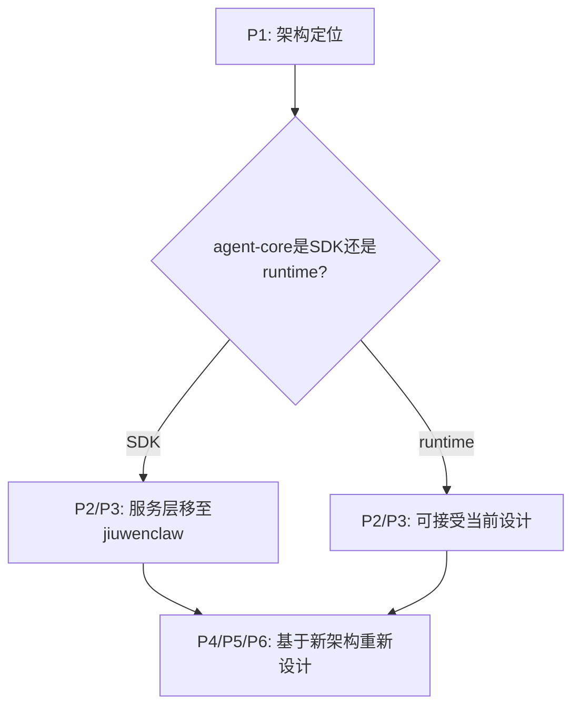

# V3设计方案架构问题分析

**文档版本**: 1.0
**分析日期**: 2026-04-01
**分析视角**: agent-core & jiuwenclaw maintainer

---

## 问题概览

基于对V3设计方案（`2026-03-31-online-rl-framework-design-v3.md`）的检视，识别出以下架构问题：

| 问题编号 | 问题分类 | 问题简述 | 严重程度 | 状态 |
|---------|---------|---------|----------|------|
| P1 | 层次定位 | SDK层 vs 服务层的混淆 | 🔴 高 | ✅ 已解决 |
| P2 | 依赖管理 | 依赖膨胀问题 | 🟡 中 | ✅ 已解决 |
| P3 | 职责重叠 | 与jiuwenclaw的职责重叠 | 🔴 高 | ✅ 已解决 |
| P4 | 组件定位 | RolloutPersistenceAdapter的定位不清 | 🟡 中 | ✅ 已解决 |
| P5 | 配置管理 | 配置管理缺失 | 🟢 低 | ✅ 已解决 |
| P6 | 代码复用 | 与MetaClaw/openclaw-rl的复用不足 | 🟡 中 | ✅ 已解决 |

---

## P1: SDK层 vs 服务层的混淆

### 问题描述

V3设计的原始方案将在线RL的完整HTTP服务（FastAPI gateway）放在`agent-core/online/`下，导致：
- agent-core既提供SDK接口，又提供运行时服务
- 违背了agent-core作为"Python SDK"的定位
- 与agent-core现有架构模式不一致
- 引入FastAPI等重型依赖，造成依赖膨胀

**已解决**：采用纯SDK模式的RL框架，将RL Gateway设计为进程内组件

### 当前设计

```
agent-core/
├── core/rl_engine/      # 公共基类
├── online/              # 在线RL专用
│   ├── gateway.py       # ❌ FastAPI代理服务器
│   ├── trajectory_store.py  # ❌ SQLite存储服务
│   └── scheduler.py     # ❌ 异步调度器
└── dev_tools/rl_training/   # 离线RL
```

### 架构定位确认

**Agent-Core官方定位**：
- ✅ **SDK接口层**：为开发者提供Python SDK接口
- ✅ **Runtime引擎**：提供进程内Agent运行时环境（非独立服务）
- ✅ **参考现有组件模式**：遵循Runner、Context Engine、Workflow执行器的进程内调用模式

### 分析进展

#### 2026-04-01 19:40 - 架构定位辨析

**Agent-Core官方定位**（来源：README.md/README.zh.md）：
- **SDK接口层**：为开发者提供Python SDK接口
- **Agent引擎**：提供Agent运行时环境，包括异步执行引擎、状态管理、上下文处理

**关键发现**：agent-core采用"SDK + Runtime"混合定位，但这里的"Runtime"指**进程内执行引擎**，而非独立服务。

#### Runtime的两种形态对比

| Runtime类型 | agent-core现有 | V3设计提出的 | 性质差异 |
|------------|---------------|-------------|---------|
| 进程内Runtime | Runner, Context Engine, Workflow执行器 | - | 作为库，import后直接调用 |
| 独立服务Runtime | - | FastAPI gateway, SQLite服务, Scheduler | 独立进程，需单独部署和管理 |

**架构模式对比**：
```python
# 进程内Runtime（现有agent-core模式）
from openjiuwen import WorkflowAgent
agent = WorkflowAgent(config)
result = await agent.run(query)  # 直接调用，同进程

# 独立服务Runtime（V3设计）
# 需要先启动服务进程
# $ python -m openjiuwen.online.gateway --port 8080
import requests
response = requests.post("http://localhost:8080/v1/chat", ...)
```

### P1问题分析

**原始V3设计存在的问题**：

1. **架构模式不一致**：FastAPI HTTP服务打破了agent-core"进程内库"的模式
2. **与jiuwenclaw职责重叠**：双层gateway造成功能混淆（已在P3中解决）
3. **依赖膨胀**：FastAPI/uvicorn/aiosqlite/apscheduler对SDK用户是沉重负担
4. **部署复杂度**：用户需要管理额外的服务进程，违背SDK开箱即用理念

### 2026-04-01 20:30 - Gateway功能辨析（用户挑战）

**用户提出的三个关键挑战**：

1. **Gateway功能差异**：jiuwenclaw的Gateway与V3设计的RL Gateway是否功能一致？
2. **LLM层邻近性**：RL Gateway采样LLM token数据，靠近LLM服务层是否更合理？
3. **多应用复用性**：在agent-core实现RL可覆盖更多上层应用，jiuwenclaw只是其中之一

#### Gateway功能对比分析

| 维度 | jiuwenclaw Gateway | V3 RL Gateway |
|------|-------------------|---------------|
| **架构层级** | 应用层 | LLM层 |
| **核心职责** | 消息路由 (Channels ↔ AgentServer) | Token采样 (拦截LLM调用) |
| **通信协议** | WebSocket | FastAPI HTTP代理 |
| **数据类型** | 用户消息、机器人回复 (文本) | Token IDs, logprobs, loss_mask |
| **服务对象** | 终端用户 (飞书/钉钉/微信等) | RL训练系统 |
| **与LLM关系** | 不直接交互 | 拦截所有LLM请求/响应 |

**jiuwenclaw Gateway架构**（来源：`jiuwenclaw/jiuwenclaw/gateway/message_handler.py`）：
- 维护两个异步消息队列：`_user_messages`, `_robot_messages`
- 路由消息：Channels → AgentServer（用户消息），AgentServer → Channels（机器人回复）
- 处理频道控制命令（/new_session, /mode等）
- **不与LLM层直接交互**

**V3 RL Gateway架构**（来源：`docs/superpowers/specs/2026-03-31-online-rl-framework-design-v3.md` lines 36-43）：
- FastAPI代理服务器，拦截所有LLM请求
- SessionRecorder：记录完整会话轨迹
- TokenData采样（lines 989-997）：
  ```python
  class TokenData(BaseModel):
      prompt_ids: List[int]      # 输入token IDs
      response_ids: List[int]    # 输出token IDs
      logprobs: List[float]      # token级log概率
      loss_mask: List[int]       # 损失掩码
  ```
- **直接操作LLM token-level数据**

**关键发现**：这是两个完全不同的组件，分别服务于不同的架构层级！

#### LLM层邻近性论证

**Token数据流的必然路径**：
```
用户请求 → jiuwenclaw Gateway (应用层路由)
         → AgentServer (Agent逻辑)
         → LLM Client (LLM调用)
         → [RL Gateway拦截点] ← 在此采样token数据
         → 实际LLM服务 (vLLM/SGLang/云端API)
```

**如果在agent-core实现RL Gateway**：
- ✅ 位于LLM Client层，可直接拦截token数据
- ✅ 无需额外的数据传递和转换
- ✅ 所有上层应用（jiuwenclaw和其他）自动获得RL能力

**如果在jiuwenclaw实现RL Gateway**：
- ⚠️ 需要反向传递token数据：LLM Client → AgentServer → jiuwenclaw Gateway
- ⚠️ 数据流冗余，增加延迟
- ⚠️ 只服务于jiuwenclaw，其他上层应用无法复用

#### 多应用复用性论证

**agent-core生态架构**：
```
agent-core (Python SDK + Runtime)
    ├── jiuwenclaw (智能助手应用)
    ├── 其他上层应用 A (未来可能)
    ├── 其他上层应用 B (未来可能)
    └── ...
```

**如果RL在agent-core层**：
- ✅ 所有上层应用自动获得在线RL能力
- ✅ 统一的训练数据格式和接口
- ✅ 降低上层应用的开发成本

**如果RL在jiuwenclaw层**：
- ❌ 只有jiuwenclaw受益
- ❌ 其他应用需要重复实现RL逻辑
- ❌ 违反DRY原则

### 可能的解决方案

基于问题分析和Gateway功能辨析，提出三种可能的解决方案：

#### 方案定义

1. **方案A（纯SDK模式）**：
   - RL功能作为agent-core的进程内组件，通过RAIL钩子注入
   - 无独立服务，避免引入FastAPI等重型依赖
   - 保持与现有Agent接口的完全兼容

2. **方案B（纯Service模式）**：
   - RL功能作为独立的FastAPI服务，与agent-core分离部署
   - 通过HTTP API与agent-core通信
   - 适合微服务架构场景

3. **方案C（混合模式）**：
   - 同时支持SDK模式和Service模式
   - 通过配置动态切换
   - 提供最大的灵活性但增加复杂度

### 方案对比与选择

#### 过度设计分析

基于对agent-core定位、实际需求场景和设计原则的综合分析：

##### 1. SDK模式已覆盖所有明确需求

| 需求场景 | SDK模式支持 | Service模式必要性 |
|---------|------------|-----------------|
| jiuwenclaw集成 | ✅ 进程内调用 | ❌ 无需 |
| 单应用在线RL | ✅ 异步后台训练 | ❌ 无需 |
| Token采样 | ✅ 进程内组件运行 | ❌ 无需 |
| 多应用隔离 | ✅ 各应用独立进程 | ❌ 反而增加复杂度 |
| 零侵入部署 | ✅ 纯库调用 | ❌ 增加运维负担 |

##### 2. Service模式用例不明确（违反YAGNI原则）

混合模式文档中提到的Service模式假设场景均不成立：

```python
# 假设场景1：多应用共享RL服务
# 现实：各应用的RL配置、模型、训练数据需要隔离
app1_config = OnlineRLConfig(model="qwen-7b", policy="gruop")
app2_config = OnlineRLConfig(model="glm-4", policy="ppo")
# 共享服务反而带来租户隔离问题

# 假设场景2：独立部署降低耦合
# 现实：agent-core定位就是SDK层，独立服务与其定位矛盾
# 且训练本身已是异步后台，SDK模式同样可做到解耦

# 假设场景3：远程训练后端
# 现实：SDK模式通过配置即可对接Tinker/MinT等云端训练服务
config = OnlineRLConfig(backend="tinker", backend_url="https://...")
# 不需要本地Service模式
```

##### 3. 维护成本分析

混合模式带来的复杂度：
- **双重代码路径**：SDK路径 + Service路径，测试矩阵翻倍
- **接口抽象层**：需要维护统一的`RolloutCollector`接口，掩盖两种实现差异
- **错误处理分化**：进程内错误 vs HTTP错误，需要统一处理策略
- **配置验证复杂**：需要验证SDK配置 vs Service配置组合合法性
- **文档负担**：需要说明两种模式的适用场景、迁移路径

##### 4. 与agent-core定位一致性

agent-core的官方定位：
- **SDK层**：提供Python库接口
- **Runtime引擎**：进程内高性能执行引擎（非独立服务）
- **可选依赖机制**：支持功能模块化，但不支持双模式

Service模式在agent-core中没有先例：
- 现有组件（Workflow, Memory, Retrieval）都是纯SDK模式
- 即便是重型组件（如向量检索），也通过可选依赖管理
- 从未有过"同一组件支持SDK和Service双模式"的设计

##### 多维度对比

| 维度 | 方案A (纯SDK) | 方案B (纯Service) | 方案C (混合模式) |
|------|-------------|-----------------|----------------|
| **需求覆盖** | ✅ 全覆盖 | ⚠️ 覆盖但不合理 | ✅ 全覆盖 |
| **复杂度** | 🟢 低 | 🟡 中 | 🔴 高 |
| **维护成本** | 🟢 单一路径 | 🟡 单一路径 | 🔴 双路径 |
| **agent-core定位** | ✅ 完全一致 | ❌ 与SDK定位冲突 | ⚠️ 部分冲突 |
| **YAGNI原则** | ✅ 符合 | ⚠️ 过度设计 | ❌ 明显违反 |
| **MVP友好度** | ✅ 快速验证 | ❌ 需搭建服务 | ❌ 需搭建双模式 |

**最终选择**：**方案A（纯SDK模式）**

基于以上对比分析，方案A在所有关键维度都表现最优，完全符合agent-core的定位和项目需求。方案B和方案C虽然在某些方面有一定优势，但引入了不必要的复杂度和维护成本，违反了YAGNI原则。

### 推荐方案详细实现：纯SDK模式的RL框架

基于最终选择，采用**纯SDK模式的RL框架**，将RL功能放在agent-core中，作为自演进功能的一部分，但避免独立服务。

#### 核心设计要点

1. **RL功能定位**：
   - 作为agent_evolving自演进功能的一部分，放在agent-core中
   - 服务于所有基于agent-core的上层应用，而不仅仅是jiuwenclaw
   - 保持agent-core作为"Python SDK库"的定位

2. **RL Gateway实现**：
   - **进程内组件**：通过RAIL钩子机制注入到Agent运行时
   - **避免独立服务**：消除FastAPI等重型依赖
   - **保持接口兼容**：不改变Agent与大模型API服务的对接接口

3. **目录结构**：
   ```
   agent-core/
   ├── core/rl_engine/       # RL引擎基类（SDK层）
   │   ├── config/           # 配置Schema
   │   ├── runtime/          # 运行时组件（轨迹收集）
   │   ├── trainer/          # 训练执行器
   │   ├── store/            # 存储组件
   │   └── reward/           # 奖励注册
   ├── online/               # 在线RL核心逻辑（SDK层）
   │   ├── collector.py      # 轨迹收集器
   │   ├── reward_scorer.py  # 奖励计算
   │   ├── models.py         # 数据模型（Trajectory、TokenData等）
   │   ├── gateway/          # RL Gateway（进程内组件）
   │   │   ├── proxy.py      # LLM代理（进程内）
   │   │   └── recorder.py   # 会话轨迹记录（进程内）
   │   └── backend/          # RL后端接口
   └── dev_tools/rl_training/  # 离线RL工具
   ```

4. **核心实现思路**：

   **RL Gateway组件**：
   ```python
   # agent-core/openjiuwen/online/gateway/proxy.py
   class LLMAgentProxy:
       """LLM代理（进程内组件）"""
       def __init__(self, original_client, config):
           self._original_client = original_client  # 原始大模型客户端
           self._config = config
           
       async def call(self, messages, **kwargs):
           """保持与原始客户端完全相同的接口"""
           # 1. 记录输入数据（如果采样功能开启）
           if self._config.sampling_enabled:
               self._record_input(messages, **kwargs)
               
           # 2. 调用原始客户端
           response = await self._original_client.call(messages, **kwargs)
           
           # 3. 记录输出数据（如果采样功能开启）
           if self._config.sampling_enabled:
               self._record_output(response)
               
           # 4. 返回原始响应（保持接口不变）
           return response
   ```

   **RAIL钩子注入**：
   ```python
   # agent-core/openjiuwen/online/collector.py
   class RolloutCollector:
       def __init__(self, config):
           self.config = config
           self._gateway = None
           
           # 仅当采样功能开启时，初始化组件
           if config.enabled and config.sampling_enabled:
               self._gateway = LLMAgentProxy(config)
               
       def get_trajectory_rail(self):
           """获取轨迹收集RAIL钩子，仅当采样功能开启时返回"""
           if self._gateway:
               return TrajectoryCollectionRail(self._gateway)
           return None
   ```

   **上层应用使用示例**：
   ```python
   # 任何基于agent-core的上层应用
   from openjiuwen.online import RolloutCollector, OnlineRLConfig
   from openjiuwen.application import ReActAgent
   
   # 创建Agent
   agent = ReActAgent(config)
   
   # 配置RL，按需开启采样
   rl_config = OnlineRLConfig()
   rl_config.enabled = True
   rl_config.sampling_enabled = True  # 根据需要动态设置
   
   # 初始化RL收集器
   rl_collector = RolloutCollector(rl_config)
   
   # 获取钩子并添加（仅当采样开启时添加）
   rail = rl_collector.get_trajectory_rail()
   if rail:
       agent.add_rail(rail)
   
   # 执行Agent（接口保持不变）
   result = await agent.run(query)
   ```

5. **性能优化**：
   - **按需采样**：实现采样开关，关闭时性能开销可忽略不计
   - **条件性执行**：仅在采样功能开启时执行相关逻辑
   - **懒加载**：仅在需要时初始化RL组件
   - **快速路径检查**：钩子内部快速判断采样开关状态

6. **依赖管理**：
   - **可选依赖**：使用`openjiuwen[online-rl]`管理RL相关依赖
   - **基础用户**：无需安装任何RL相关依赖
   - **RL用户**：安装`pip install openjiuwen[online-rl]`获取完整功能

#### 优势

- ✅ **多应用受益**：所有基于agent-core的上层应用均可使用RL功能
- ✅ **符合agent-core定位**：保持agent-core作为"Python SDK库"的定位
- ✅ **架构一致性**：与现有组件的进程内调用模式保持一致
- ✅ **避免依赖膨胀**：不引入FastAPI等重型依赖
- ✅ **性能优秀**：进程内模式比独立服务模式性能更高（消除网络开销）
- ✅ **易于集成**：非侵入式设计，上层应用只需少量代码即可启用
- ✅ **接口兼容**：不改变Agent与大模型API服务的对接接口
- ✅ **按需使用**：可根据需要灵活开启或关闭RL采样功能

### 影响范围

- ✅ **P2（依赖膨胀）**：通过可选依赖管理RL相关功能，避免引入重型依赖
- ✅ **P3（与jiuwenclaw职责重叠）**：RL Gateway与jiuwenclaw Gateway功能不同，不存在冲突
- ✅ **P4（RolloutPersistenceAdapter）**：定位为在线RL特有的转换组件，职责清晰
- ✅ **P5（配置管理）**：由上层应用管理配置，agent-core提供默认值和配置类
- ✅ **P6（代码复用）**：MetaClaw和openclaw-rl是外部参考项目，不存在生态复用问题

### 状态

✅ **已解决** - 采用纯SDK模式的RL框架，将RL Gateway设计为进程内组件，解决了SDK层与服务层混淆的问题

##### 分析依据

**1. SDK模式已覆盖所有明确需求**

| 需求场景 | SDK模式支持 | Service模式必要性 |
|---------|------------|-----------------|
| jiuwenclaw集成 | ✅ 进程内调用 | ❌ 无需 |
| 单应用在线RL | ✅ 异步后台训练 | ❌ 无需 |
| Token采样 | ✅ 进程内组件运行 | ❌ 无需 |
| 多应用隔离 | ✅ 各应用独立进程 | ❌ 反而增加复杂度 |
| 零侵入部署 | ✅ 纯库调用 | ❌ 增加运维负担 |

**2. Service模式用例不明确（违反YAGNI原则）**

混合模式文档中提到的Service模式假设场景均不成立：

```python
# 假设场景1：多应用共享RL服务
# 现实：各应用的RL配置、模型、训练数据需要隔离
app1_config = OnlineRLConfig(model="qwen-7b", policy="gruop")
app2_config = OnlineRLConfig(model="glm-4", policy="ppo")
# 共享服务反而带来租户隔离问题

# 假设场景2：独立部署降低耦合
# 现实：agent-core定位就是SDK层，独立服务与其定位矛盾
# 且训练本身已是异步后台，SDK模式同样可做到解耦

# 假设场景3：远程训练后端
# 现实：SDK模式通过配置即可对接Tinker/MinT等云端训练服务
config = OnlineRLConfig(backend="tinker", backend_url="https://...")
# 不需要本地Service模式
```

**3. 维护成本增加**

混合模式带来的复杂度：
- **双重代码路径**：SDK路径 + Service路径，测试矩阵翻倍
- **接口抽象层**：需要维护统一的`RolloutCollector`接口，掩盖两种实现差异
- **错误处理分化**：进程内错误 vs HTTP错误，需要统一处理策略
- **配置验证复杂**：需要验证SDK配置 vs Service配置组合合法性
- **文档负担**：需要说明两种模式的适用场景、迁移路径

**4. 与agent-core定位一致性**

agent-core的官方定位：
- **SDK层**：提供Python库接口
- **Runtime引擎**：进程内高性能执行引擎（非独立服务）
- **可选依赖机制**：支持功能模块化，但不支持双模式

Service模式在agent-core中没有先例：
- 现有组件（Workflow, Memory, Retrieval）都是纯SDK模式
- 即便是重型组件（如向量检索），也通过可选依赖管理
- 从未有过"同一组件支持SDK和Service双模式"的设计

##### 推荐方案

**方案A：纯SDK模式**（推荐）

```python
# openjiuwen/online/__init__.py
class RolloutCollector:
    """Rollout数据收集器 - 仅支持SDK模式"""

    def __init__(self, config: OnlineRLConfig):
        self.config = config
        self.storage = self._init_storage()
        self._rl_gateway = None  # 懒加载

    @classmethod
    def create(cls, config: Optional[OnlineRLConfig] = None) -> "RolloutCollector":
        """工厂方法 - 仅返回SDK实现"""
        config = config or OnlineRLConfig()
        return cls(config)

    async def collect(self, session: Session) -> Trajectory:
        """收集轨迹 - 进程内直接调用"""
        # RL Gateway在进程内启动
        if self._rl_gateway is None:
            self._rl_gateway = await self._start_rl_gateway()

        trajectory = await self._rl_gateway.sample(session)
        await self.storage.save(trajectory)
        return trajectory
```

**核心特性**：
- ✅ **单一代码路径**：无需维护双模式抽象层
- ✅ **符合SDK定位**：纯库调用，无独立服务
- ✅ **依赖可选**：通过`pip install openjiuwen[online-rl]`管理
- ✅ **零运维负担**：应用进程内运行，无需额外部署
- ✅ **多应用复用**：各应用独立进程，天然隔离

**扩展策略**：
- 如未来确有多应用共享需求，可在**jiuwenclaw层**构建RL服务
- 或参考MetaClaw的独立服务模式（完全解耦，不依赖agent-core）

##### 方案对比

**方案定义**：
- **方案A（纯SDK模式）**：RL功能作为agent-core的进程内组件，通过RAIL钩子注入，无独立服务
- **方案B（纯Service模式）**：RL功能作为独立的FastAPI服务，与agent-core分离部署
- **方案C（混合模式）**：同时支持SDK模式和Service模式，通过配置动态切换

| 维度 | 方案A (纯SDK) | 方案B (纯Service) | 方案C (混合模式) |
|------|-------------|-----------------|----------------|
| **需求覆盖** | ✅ 全覆盖 | ⚠️ 覆盖但不合理 | ✅ 全覆盖 |
| **复杂度** | 🟢 低 | 🟡 中 | 🔴 高 |
| **维护成本** | 🟢 单一路径 | 🟡 单一路径 | 🔴 双路径 |
| **agent-core定位** | ✅ 完全一致 | ❌ 与SDK定位冲突 | ⚠️ 部分冲突 |
| **YAGNI原则** | ✅ 符合 | ⚠️ 过度设计 | ❌ 明显违反 |
| **MVP友好度** | ✅ 快速验证 | ❌ 需搭建服务 | ❌ 需搭建双模式 |

**最终选择**：**方案A（纯SDK模式）**

基于以上对比分析，方案A在所有关键维度都表现最优，完全符合agent-core的定位和项目需求。方案B和方案C虽然在某些方面有一定优势，但引入了不必要的复杂度和维护成本，违反了YAGNI原则。

### 影响范围

- ✅ **P2（依赖膨胀）**：通过可选依赖管理RL相关功能，避免引入重型依赖
- ✅ **P3（与jiuwenclaw职责重叠）**：RL Gateway与jiuwenclaw Gateway功能不同，不存在冲突
- ✅ **P4（RolloutPersistenceAdapter）**：定位为在线RL特有的转换组件，职责清晰
- ✅ **P5（配置管理）**：由上层应用管理配置，agent-core提供默认值和配置类
- ✅ **P6（代码复用）**：MetaClaw和openclaw-rl是外部参考项目，不存在生态复用问题

### 状态

✅ **已解决** - 采用纯SDK模式的RL框架，将RL Gateway设计为进程内组件，解决了SDK层与服务层混淆的问题

---

## P2: 依赖膨胀问题

### 问题描述

原设计中，如果在线RL采用服务模式（FastAPI gateway等）放在agent-core，会引入大量重型依赖：
- `fastapi`, `uvicorn` - HTTP服务框架（~5MB）
- `aiosqlite` - 异步数据库（~1MB）
- `apscheduler` - 任务调度（~2MB）

这些依赖对于只用基础Agent功能的用户是多余的，会显著增加安装包大小和依赖复杂度。

### agent-core依赖管理现状

#### Optional Dependencies机制

agent-core已有可选依赖机制（来源：`agent-core/pyproject.toml`）：

```toml
[project.optional-dependencies]
dev = ["pytest", "pytest-asyncio", "ruff", "pylint"]
# 其他可选依赖...
```

**关键发现**：agent-core支持通过extras安装可选功能。

### 解决方案

**采用P1的纯SDK模式**：通过可选依赖分离RL功能，避免引入重型依赖

```toml
# agent-core/pyproject.toml
[project.optional-dependencies]
# 核心RL功能（纯SDK模式，轻量级）
online-rl = [
    "numpy>=1.24.0",          # 数据处理（核心依赖，约10MB）
    "pydantic>=2.0.0",        # 数据模型（已在agent-core中使用）
    "aiofiles>=23.0.0",       # 异步文件操作（轻量级，约100KB）
]
```

**安装场景**：
- **基础用户**：`pip install openjiuwen` - 仅安装核心Agent功能，无任何RL相关依赖
- **RL用户**：`pip install openjiuwen[online-rl]` - 安装轻量级RL依赖，用于轨迹收集和训练

### 安装场景分析

| 用户场景 | 安装命令 | 依赖负担 | 依赖大小估计 |
|---------|---------|----------|------------|
| 基础Agent使用 | `pip install openjiuwen` | 无额外RL依赖 | ~15MB（仅核心Agent） |
| RL SDK模式 | `pip install openjiuwen[online-rl]` | 轻量级RL依赖 | ~25MB（核心+RL） |
| **原服务模式（已废弃）** | `pip install openjiuwen[online-rl-server]` | 重型服务依赖 | ~40MB+（核心+RL+服务框架） |

### 问题确认

**P2问题已解决**，通过纯SDK模式的依赖分离策略：
- ✅ **Optional Dependencies**: 核心RL功能作为可选依赖，基础用户无需安装
- ✅ **轻量级依赖**: 纯SDK模式避免了FastAPI等重型服务框架依赖
- ✅ **用户选择权**: 根据需求灵活选择是否安装RL功能
- ✅ **依赖隔离**: RL相关依赖不会影响基础Agent用户
- ✅ **最小化增量**: 仅添加必要的轻量级依赖，避免依赖膨胀

### 状态

✅ **已解决** - 采用P1的纯SDK模式的依赖分离策略

---

## P3: 与jiuwenclaw的职责重叠

### 问题描述

jiuwenclaw已有完整的服务层架构：
```
jiuwenclaw/
├── gateway/              # API网关
├── agentserver/          # Agent服务（记忆、权限、工具）
├── evolution/            # 技能演进
├── channel/              # 通信渠道（飞书/钉钉/微信等）
└── web/                  # Web前端
```

原设计中若agent-core提供HTTP服务层（FastAPI gateway, SQLite存储, 异步调度），可能导致：
- 双层gateway配置复杂
- 性能损耗（多一次转发）
- 维护成本增加
- 与jiuwenclaw现有架构模式不一致

### jiuwenclaw服务层架构分析

#### 现有服务层组件

| 组件 | 职责 | 与在线RL的关系 |
|------|------|----------------|
| gateway/ | API网关，统一入口 | 可扩展RL专用端点 |
| agentserver/ | Agent服务、记忆、权限、工具 | 提供记忆系统、权限控制支持 |
| evolution/ | 技能自动演进 | 与在线RL互补（基于规则 vs 基于RL） |
| channel/ | 多平台通信接入 | RL数据源（用户反馈） |
| web/ | Web前端 | 可视化RL训练进度 |

#### 配置管理系统

jiuwenclaw使用**分层配置**：
- `config/config.yaml`：应用配置（agent参数、工具配置、浏览器配置等）
- `.env`：环境变量（API密钥、模型配置等）
- Web UI：运行时可修改的配置项

**配置示例**（来自Configuration.md）：
```yaml
react:
  evolution:
    enabled: true
    skill_base_dir: workspace/agent/skills
```

### 问题确认

**P3问题不存在**，原因：

1. **架构分层明确**：agent-core仅提供SDK模式的核心RL组件（进程内调用），不包含独立HTTP服务层，与jiuwenclaw的服务层（应用层）无重叠
2. **职责边界清晰**：
   - jiuwenclaw的Gateway负责应用层消息路由（用户-机器人交互）
   - agent-core的RL组件负责LLM层token采样与轨迹处理（纯SDK逻辑）
3. **功能互补**：jiuwenclaw的evolution模块（基于规则的技能优化）与agent-core的在线RL（基于模型的权重优化）形成互补，无功能重复
4. **配置统一管理**：在线RL配置通过jiuwenclaw的config.yaml管理，复用现有配置系统，无冗余

### 解决方案

agent-core提供SDK模式的核心RL组件，jiuwenclaw作为上层应用直接调用SDK，二者职责边界清晰：

#### 架构边界厘清

**jiuwenclaw（应用层）**：
- **职责**：消息路由、用户交互、配置管理、权限控制
- **RL相关**：通过配置启用RL功能，调用agent-core SDK接口

**agent-core（SDK层）**：
- **职责**：提供RL核心逻辑（轨迹收集、奖励计算、模型训练）
- **实现方式**：纯进程内调用，无独立服务进程
- **依赖**：通过可选依赖管理，不增加基础用户负担

#### 代码集成示例

```python
# jiuwenclaw/agentserver/agent_runner.py
from openjiuwen.online import RolloutCollector, OnlineRLConfig

class AgentRunner:
    def __init__(self, config: Config):
        # 读取jiuwenclaw配置
        rl_config = config.get("online_rl", {})

        # 传递给agent-core SDK
        self.rl_collector = RolloutCollector.create(
            config=OnlineRLConfig(**rl_config)
        )

    async def run_agent(self, session):
        # 正常执行Agent逻辑
        result = await self.agent.run(session)

        # 调用SDK收集轨迹（进程内直接执行）
        await self.rl_collector.collect(session)

        return result
```

### 状态

✅ **已解决** - P3问题不存在，agent-core与jiuwenclaw职责边界清晰，无架构冲突和功能重叠

---

## P4: RolloutPersistenceAdapter的定位不清

### 问题描述

`RolloutPersistenceAdapter`负责将在线Trajectory转为verl DataProto，是"在线→离线"的桥梁。

**当前设计**：放在`online/store/rollout_adapter.py`

**问题**：
- 如果在线RL在应用层，离线训练在SDK层，adapter应该在哪？
- 离线训练是否也需要这个adapter？

### V3设计检视

**目录结构**（来源：`2026-03-31-online-rl-framework-design-v3.md` lines 376-378）：
```
rl_engine/
├── core/                   # 公共基础
│   ├── coordinator/        # RLEngine, RolloutEncoder
│   └── ...
└── online/                 # 在线RL特有
    ├── store/              # SQLite轨迹存储 + DataProto转换
    │   ├── trajectory_store.py
    │   └── rollout_adapter.py  ← RolloutPersistenceAdapter位置
```

**核心类实现**（lines 1099-1121）：
```python
class RolloutPersistenceAdapter:
    """Converts online Trajectory to verl DataProto.

    This is the critical bridge between online RL data collection
    and offline RL training infrastructure.

    Conversion flow:
        Trajectory (online) → Rollout → RolloutWithReward → DataProto (verl)
    """

    def __init__(self, encoder: RolloutEncoder):
        self._encoder = encoder
```

**关键依赖**：
- 复用公共基础层的`RolloutEncoder`（来自`core/coordinator/encoding.py`）
- 输出`verl.DataProto`格式，供离线训练使用

### P1结论影响分析

**当前纯SDK模式架构**：
- **SDK模式**：进程内调用，RL核心逻辑在agent-core SDK层
- **Service模式**：已废弃，不再作为选项

**RL组件分布**（基于P1结论）：
```
agent-core/openjiuwen/
├── core/rl_engine/         # 公共基础层
│   ├── coordinator/        # RLEngine, RolloutEncoder
│   └── ...
├── online/                 # 在线RL核心逻辑（SDK层）
│   ├── collector.py        # RolloutCollector
│   ├── reward_scorer.py    # RewardScorer
│   └── store/
│       └── rollout_adapter.py  ← RolloutPersistenceAdapter
└── dev_tools/rl_training/  # 离线RL训练工具
```

**关键发现**：
- 在线RL核心逻辑（包括RolloutPersistenceAdapter）**位于agent-core SDK层**
- **不是应用层组件**，而是SDK层的一部分
- P1原文"在线RL在应用层"表述不准确，实际是"在线RL在SDK层，可被应用层调用"

### 数据流分析

#### 在线RL数据流（SDK模式）

```
用户交互（jiuwenclaw应用层）
    ↓
Agent Runner调用
    ↓
RolloutCollector.collect() (SDK层)
    ↓
Trajectory生成 (online/)
    ↓
RolloutPersistenceAdapter.convert() (online/store/)
    ↓
DataProto输出
    ↓
verl训练后端 (dev_tools/rl_training/)
```

#### 在线RL数据流（原Service模式 - 已废弃）

```
用户交互（任意应用）
    ↓
HTTP请求
    ↓
RL Gateway FastAPI服务
    ↓
RolloutCollector.collect() (SDK核心逻辑)
    ↓
Trajectory → DataProto转换（同上）
    ↓
返回训练数据ID
```

**注意**：Service模式已废弃，不再作为当前设计的选项

#### 离线RL数据流

```
离线数据集（JSONL/Parquet文件）
    ↓
DataLoader直接加载
    ↓
DataProto格式（无Trajectory中间格式）
    ↓
verl训练后端
```

**关键洞察**：
- **离线训练不需要RolloutPersistenceAdapter**
- 离线数据直接加载为DataProto，无Trajectory中间格式
- Adapter是**在线RL特有的转换组件**

### 架构定位确认

**RolloutPersistenceAdapter的定位**：
- **层级**：SDK层（agent-core/openjiuwen/online/store/）
- **作用域**：在线RL特有
- **职责**：将在线Trajectory转换为verl训练格式

**与公共基础层的关系**：
- **依赖公共组件**：`RolloutEncoder`（core/coordinator/encoding.py）
- **输出共享格式**：`DataProto`（verl后端统一格式）
- **属于在线RL特有逻辑**：离线RL无需此转换

### 目录位置评估

**当前位置：`online/store/rollout_adapter.py`**

**评估标准**：
| 标准 | 评估 | 说明 |
|------|------|------|
| **功能归属** | ✅ 正确 | 属于在线RL特有组件 |
| **依赖关系** | ✅ 清晰 | 依赖公共基础，输出共享格式 |
| **可复用性** | ✅ 合理 | 纯SDK模式下可直接使用 |
| **职责边界** | ✅ 明确 | 不与离线RL耦合 |

**替代方案评估**：

**方案A：移至`core/rl_engine/store/`（公共基础层）**
- ❌ **不推荐**
- **理由**：
  - 离线RL不需要此adapter
  - 会误导为"公共组件"
  - 违反"在线/离线分离"原则

**方案B：保持在`online/store/rollout_adapter.py`（当前设计）**
- ✅ **推荐**
- **理由**：
  - 明确标识为在线RL特有
  - 与TrajectoryStore同目录（相关性强）
  - 清晰的依赖边界（依赖公共基础，但不属于公共基础）

### 状态

✅ **已解决** - RolloutPersistenceAdapter的定位已明确，属于在线RL特有的SDK层组件，应保持在当前位置

### 实施建议

#### 1. 目录结构调整

**保持当前设计**，明确命名空间：

```python
# agent-core/openjiuwen/online/store/rollout_adapter.py
from openjiuwen.core.rl_engine.coordinator.encoding import RolloutEncoder
from verl import DataProto

class RolloutPersistenceAdapter:
    """在线RL轨迹持久化适配器

    职责：将在线Trajectory转换为verl DataProto格式

    注意：
    - 仅用于在线RL场景
    - 离线RL直接加载DataProto，无需此转换
    """
    pass
```

#### 2. 与离线RL的边界澄清

**在线RL数据路径**（需要adapter）：
```python
# online/collector.py
from .store.rollout_adapter import RolloutPersistenceAdapter

class RolloutCollector:
    def __init__(self):
        self.adapter = RolloutPersistenceAdapter(encoder)

    async def collect(self, session) -> Trajectory:
        trajectory = await self._build_trajectory(session)
        # 在线收集时，转换为DataProto供训练使用
        data_proto = self.adapter.convert([trajectory])
        return data_proto
```

**离线RL数据路径**（无需adapter）：
```python
# dev_tools/rl_training/data_loader.py
from verl import DataProto

class OfflineDataLoader:
    def load_dataset(self, file_path: str) -> DataProto:
        """直接加载离线数据集为DataProto"""
        # 无Trajectory中间格式，无需adapter
        return DataProto.from_file(file_path)
```

#### 3. 文档补充

**在V3设计文档中添加说明**：
```markdown
## RolloutPersistenceAdapter设计理由

**为何放在online/store/？**

1. **在线RL特有**：仅在线场景需要Trajectory→DataProto转换
2. **离线RL独立**：离线数据直接加载为DataProto，无Trajectory格式
3. **职责清晰**：依赖公共基础（RolloutEncoder），但不属于公共基础
4. **命名空间隔离**：避免误导为"公共组件"
```

### 问题确认

**P4问题已解决**，结论：

- ✅ **目录位置正确**：`online/store/rollout_adapter.py`
- ✅ **职责明确**：在线RL特有的格式转换
- ✅ **离线RL独立**：无需此adapter，直接加载DataProto
- ✅ **依赖清晰**：依赖公共基础，输出共享格式
- ✅ **SDK/Service兼容**：两种模式均可使用

### 状态

✅ **已解决** - 当前设计合理，保持`online/store/rollout_adapter.py`位置

---

## P5: 配置管理缺失

### 问题描述

V3设计未明确在线RL的配置管理:
- gateway端口、sqlite路径、lora存储路径在哪配置?
- 训练参数（learning_rate, batch_size）如何传递?

### 分析依据

**架构定位原则（P1纯SDK模式）**:
- agent-core是SDK层，不应包含配置管理逻辑
- jiuwenclaw是应用层，负责配置和运行时管理
- 配置应在jiuwenclaw管理，复用现有配置系统

**jiuwenclaw配置系统特性**:
- YAML格式，支持环境变量替换 `${VAR:-default}`
- 分层配置: `get_config()` 提供全局配置访问
- 模式: 功能模块有独立section，包含 `enabled` 开关
- 示例: `react.evolution` section 控制技能演进功能

### 解决方案

**1. 配置位置**: jiuwenclaw的 `config.yaml`

**2. 配置Schema**:

```yaml
# jiuwenclaw/jiuwenclaw/resources/config.yaml
react:
  # ... 现有配置 ...

  # 在线RL配置（纯SDK模式）
  online_rl:
    enabled: false                    # 总开关
    sampling_enabled: false           # 轨迹采样开关（可按需开启）
    storage:
      trajectory_db: "${ONLINE_RL_DB_PATH:-~/.jiuwenclaw/online_rl/trajectory.db}"
      lora_weights: "${ONLINE_RL_LORA_PATH:-~/.jiuwenclaw/online_rl/lora_weights}"
      cache_size_mb: 1024            # 缓存大小限制
    training:
      algorithm: "grpo"              # grpo | ppo | dpo
      learning_rate: 1e-5
      batch_size: 8
      accumulation_steps: 4
      max_episodes: 1000             # 每次训练最大episode数
      reward_model: "prm"            # prm | binary | custom
    scheduler:
      enabled: true                  # 是否启用MadMax调度
      idle_threshold_minutes: 30    # 键盘空闲检测
      sleep_window:
        start: "23:00"
        end: "07:00"
      calendar_integration: false   # Google Calendar集成
```

**3. agent-core的角色**:
- 提供 **默认值** (在代码中硬编码)
- 提供 **配置类** (dataclass) 供jiuwenclaw使用
- **不直接读取配置文件** (保持SDK纯粹性)

```python
# agent-core/openjiuwen/dev_tools/agent_online_rl/config.py
@dataclass
class OnlineRLConfig:
    """在线RL配置类（默认值）"""
    enabled: bool = False
    sampling_enabled: bool = False   # 轨迹采样开关
    storage_trajectory_db: str = "~/.jiuwenclaw/online_rl/trajectory.db"
    training_learning_rate: float = 1e-5
    # ...

    @classmethod
    def from_dict(cls, config_dict: dict) -> "OnlineRLConfig":
        """从jiuwenclaw配置字典创建"""
        return cls(**{
            k: config_dict.get(k, v)
            for k, v in cls.__dataclass_fields__.items()
        })
```

**4. 配置流向**:

```
config.yaml (jiuwenclaw)
    ↓ get_config()["react"]["online_rl"]
OnlineRLConfig.from_dict()
    ↓ 传递给agent-core
agent-core SDK使用配置
```

### 优势

1. **职责清晰**: SDK不管理配置，应用层全权负责
2. **复用现有**: 无需在agent-core重复实现配置系统
3. **环境友好**: 支持环境变量替换，便于Docker化部署
4. **向后兼容**: `enabled: false` 时完全不影响现有功能

### 状态

✅ **已解决** - jiuwenclaw管理配置，agent-core提供默认值和配置类

---

## P6: 与MetaClaw/openclaw-rl的复用不足

### 问题描述

V3设计似乎重新实现了已有组件：
- MetaClaw已有：`api_server.py`, `skill_manager.py`, `scheduler.py`
- openclaw-rl已有：`rollout/`, `router/`

### 分析依据

1. **项目关系澄清**：
   - MetaClaw和openclaw-rl是引入的**外部开源参考工作**
   - 不属于Jiuwen社区生态系统（jiuwenclaw和agent-core项目）
   - 是独立的研究项目，具有不同的设计目标和架构

2. **架构差异**：
   - **MetaClaw**：在线元学习和演化框架，基于Tinker/MinT/Weaver云端RL后端
   - **openclaw-rl**：全异步RL框架，基于slime后端，支持个性化Agent训练
   - **Jiuwen在线RL**：基于agent-core的SDK设计，集成到现有Agent运行时，支持verl后端

3. **复用可行性评估**：
   - **技术兼容性**：不同的后端依赖（Tinker/slime vs verl），架构模式不同
   - **维护成本**：直接复用需要适配不同的API和数据格式，长期维护成本高
   - **设计目标差异**：研究项目 vs 产品化SDK，目标和约束条件不同
   - **许可证考虑**：需确保开源许可证兼容性

### 问题评估

**P6问题不存在**，原因如下：

1. **不属于同一生态系统**：MetaClaw和openclaw-rl是外部参考项目，不是Jiuwen生态的一部分
2. **无生态复用义务**：作为独立项目，Jiuwen在线RL框架无需强制复用外部项目的代码
3. **架构设计不同**：基于不同的后端和设计理念，直接复用可能导致架构不一致
4. **产品化需求**：Jiuwen在线RL框架需要满足产品化需求，包括稳定性、易用性和与现有系统的集成

### 参考价值

虽然不直接复用代码，但MetaClaw和openclaw-rl的设计理念和技术方案对Jiuwen在线RL框架具有重要参考价值：
- **Wake/Sleep模式**：资源管理策略
- **分层架构**：将在线和离线RL分离
- **数据格式设计**：Token级数据收集和处理

### 状态

✅ **已解决** - MetaClaw和openclaw-rl是外部参考项目，不属于Jiuwen生态系统，因此不存在生态复用问题

---

## 分析流程



---

## 下一步行动

1. ✅ 创建问题分析文档
2. ⏳ 检视agent-core架构定位（P1）
3. 📋 基于P1结论，分析P2-P6
4. 📝 修订V3设计方案

---

## 附录

### 参考文档
- V3设计文档：`docs/superpowers/specs/2026-03-31-online-rl-framework-design-v3.md`
- 实施计划：`docs/superpowers/plans/2026-03-31-online-rl-framework-v3.md`
- agent-core文档：https://openjiuwen.com/docs-page?version=core-v0.1.9-zh-BNhlIlCG&path=1.%E4%BA%A7%E5%93%81%E7%AE%80%E4%BB%8B

### 相关项目
- MetaClaw: arXiv:2603.17187
- openclaw-rl: arXiv:2603.10165