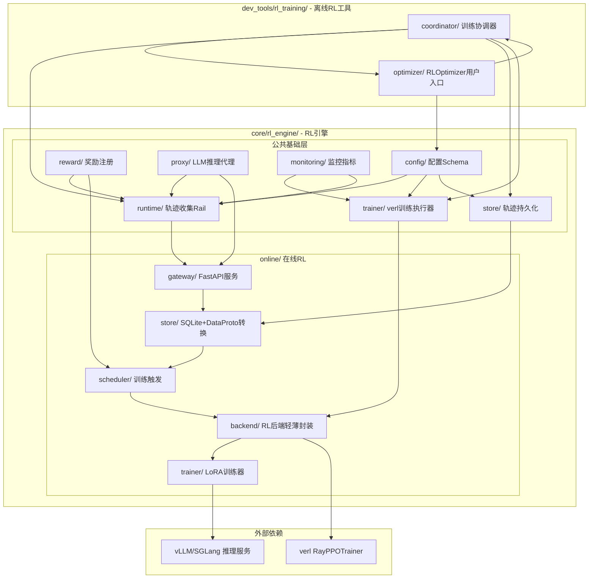
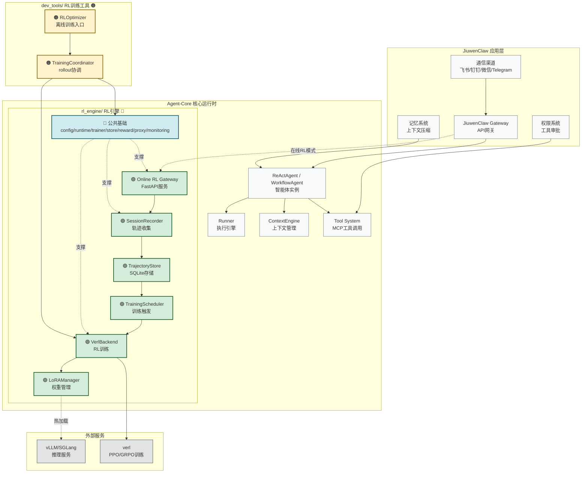
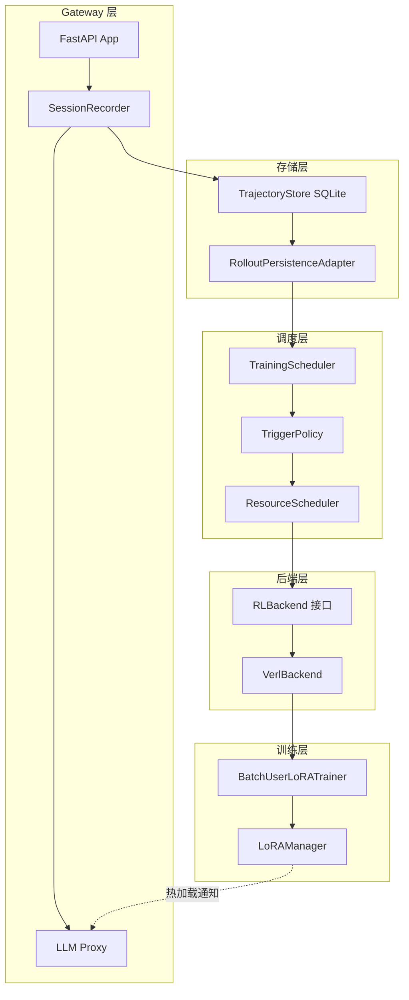
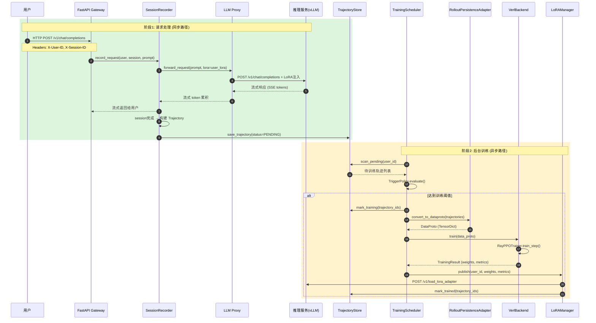
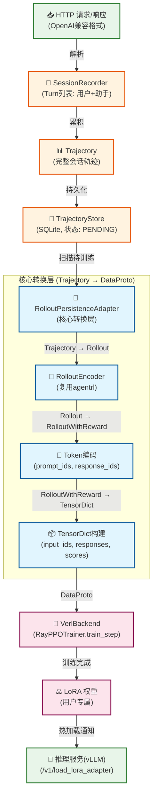

# Jiuwen Agent-Core 在线强化学习框架设计文档 (v3.0 - 重构版)

> **版本**: v3.0 (重构版)
> **日期**: 2026-03-31
> **状态**: 设计评审
> **作者**: Sisyphus (AI Agent)
> **前序版本**: v2.0 (`docs/superpowers/specs/2026-03-31-online-rl-framework-design-v2.md`)
> **参考草案**: `agent-online-rl-previous-brainstorm/`

---

## 1. 背景与目标

### 1.1 问题陈述

当前 Jiuwen 平台已有一套 RL 方案：
- **离线RL**: `dev_tools/agentrl/` — 训练前批量录制轨迹 → 停止Agent → 执行训练 → 重启服务 (需要停机，用户体验差)

为参考在线学习方案，我们调研了第三方开源项目：
- **元学习参考**: MetaClaw — 在线学习，无需GPU (依赖云端Tinker/MinT/Weaver，不兼容verl)
- **强化学习框架参考**: openclaw-rl — 基于slime的异步RL框架 (arXiv:2603.10165)

**核心需求**: 在 agent-core 中构建**在线RL能力**，使智能体在不停机的前提下，一边与用户交互，一边收集轨迹，在合适的时机自动触发 LLM RL 训练。

### 1.2 设计目标

1. **零停机**: Agent 服务持续运行，训练在后台异步执行
2. **最小侵入**: 不颠覆 agent-core 和 jiuwenclaw 的既有架构
3. **生产就绪**: FastAPI 服务、并发安全、流式支持、状态管理
4. **可扩展**: 算法和调度策略未定，预留充分适配空间
5. **可复用**: 复用业界成熟组件（verl、vLLM 等），避免从零实现
6. **泛化性**: agent-core 的在线RL能力可服务于任何基于它的智能体应用

### 1.3 范围界定

**本次设计包含**:
- LLM Gateway (FastAPI 服务: Proxy + SessionRecorder + Reward 外部接口)
- 融合数据格式 (Trajectory + Turn + TokenData + 灵活Reward + 状态机)
- 轨迹存储 (SQLite TrajectoryStore + verl DataProto 转换层)
- 训练调度器 (TriggerPolicy 抽象 + ResourceScheduler 轻量封装 + BatchUserLoRATrainer)
- RL 后端轻薄抽象 (verl 优先，slime 预留)
- LoRA 权重管理 (统一版本化存储 + 热加载通知 + 元数据)

**本次设计不包含**:
- 具体 RL 算法实现（GRPO/PPO 等由后端插件提供）
- Reward 计算器的具体算法（预留外部插件接口）
- 多模态数据的具体处理（预留扩展字段）
- 具体调度策略实现（预留策略接口）

### 1.4 相关需求背景

基于 Jiuwen 平台的定位和实际应用场景，在线强化学习框架需要满足以下关键需求：

1. **智能体持续学习能力**：使基于 agent-core 构建的智能体（如 jiuwenclaw）能够从用户交互中持续学习和改进，而不仅仅依赖预训练或离线训练。

2. **多租户支持**：框架需要支持多个用户/智能体实例，每个用户都有独立的学习轨迹和个性化模型（LoRA 权重）。

3. **与现有系统集成**：需要无缝集成到 agent-core 的现有架构中，特别是：
   - 记忆系统：利用已有的上下文管理和记忆压缩机制
   - 权限系统：遵守工具访问控制和用户审批流程
   - 工具系统：支持 MCP 协议和本地工具的调用与记录
   - 通信渠道：适配多平台接入（飞书/钉钉/微信等）的消息格式

4. **实时性和响应性**：在线学习过程不应显著影响智能体的响应时间，训练应在后台异步进行。

5. **可观测性和可调试性**：提供完整的轨迹记录、训练过程监控和结果可视化能力，便于问题定位和效果评估。

6. **故障容错和恢复能力**：在网络中断、服务重启或训练失败等情况下，能够保证数据不丢失并自动恢复。

7. **资源敏感性**：能够根据可用的计算资源（特别是 GPU）动态调整训练频率和批次大小。

8. **合规性和安全性**：确保用户数据的隐私保护和训练过程的安全隔离，符合数据保护法规。

这些需求来源于对 jiuwenclaw 实际应用场景的分析，特别是在客服、个人助理和企业知识管理等需要持续优化和个性化的场景中的应用需求。

---

## 2. verl/slime API 架构分析与设计选型

### 2.1 verl API 架构分析

**源码位置**: `verl/verl/`

#### 2.1.1 数据协议 (DataProto)

verl 使用 `TensorDict` 作为核心数据交换格式，所有训练数据必须转换为张量形式。

```python
# verl/verl/protocol.py
class DataProto:
    """数据交换协议，封装张量批次和元信息"""
    batch: TensorDict              # 张量数据: input_ids, attention_mask, responses, advantages, returns
    non_tensor_batch: dict         # 非张量数据: uid, prompt_str, data_source
    meta_info: dict                # 元信息: 分片信息、填充大小等

    # 核心操作
    concat(data: list[DataProto])  # 合并多个DataProto
    make_iterator(mini_batch_size, epochs)  # mini-batch迭代器
    select(batch_keys, meta_info_keys)      # 选择子集
    to(device)                     # 设备迁移
```

**关键张量字段**:
| 字段 | 形状 | 说明 |
|------|------|------|
| `input_ids` | (batch, seq_len) | 输入token IDs |
| `attention_mask` | (batch, seq_len) | 注意力掩码 |
| `responses` | (batch, response_len) | 模型生成的response tokens |
| `token_level_scores` | (batch, response_len) | token级奖励 |
| `old_log_probs` | (batch, response_len) | 旧策略log概率 |
| `ref_log_prob` | (batch, response_len) | 参考策略log概率 |
| `advantages` | (batch, response_len) | 优势函数 |
| `returns` | (batch, response_len) | 回报值 |
| `response_mask` | (batch, response_len) | response部分掩码 |

#### 2.1.2 训练器接口 (RayPPOTrainer)

```python
# verl/verl/trainer/ppo/ray_trainer.py
class RayPPOTrainer:
    """分布式PPO训练器 (Ray后端)"""

    def __init__(
        self,
        config,                                    # OmegaConf配置对象
        tokenizer,                                 # HuggingFace tokenizer
        role_worker_mapping: dict[Role, WorkerType],  # 角色→Worker映射
        resource_pool_manager: ResourcePoolManager,   # GPU资源池管理器
        ray_worker_group_cls = RayWorkerGroup,
        train_dataset: Optional[Dataset] = None,
        val_dataset: Optional[Dataset] = None,
        ...
    ):
        # 核心角色:
        #   Role.ActorRollout  → 策略模型 + rollout生成
        #   Role.Critic        → 价值网络 (PPO需要)
        #   Role.Ref           → 参考策略 (KL惩罚)
        #   Role.RewardModel   → 奖励模型

    def fit(self):
        """主训练循环"""
        for step in range(num_steps):
            # 1. 唤醒rollout引擎 (vLLM/SGLang)
            # 2. 生成rollout数据 → DataProto
            # 3. 休眠rollout引擎
            # 4. 计算奖励 (apply_kl_penalty)
            # 5. 计算优势 (compute_advantage: GAE/GRPO/REINFORCE++)
            # 6. 执行PPO更新 (actor/critic)
            # 7. 同步权重到rollout引擎
            # 8. 保存检查点 + 日志
```

**资源管理**: verl 使用 `ResourcePoolManager` 管理 Ray 资源池，通过 `role_worker_mapping` 将不同角色 (Actor/Critic/Ref/Reward) 映射到对应的 Worker 类型。

#### 2.1.3 核心算法函数

```python
# verl/verl/trainer/ppo/core_algos.py
# 优势估计器
AdvantageEstimator.GAE     # GAE (Generalized Advantage Estimation)
AdvantageEstimator.GRPO    # GRPO (Group Relative Policy Optimization)
AdvantageEstimator.PPO     # 标准PPO
AdvantageEstimator.REINFORCE_PLUS_PLUS

# 核心计算函数
compute_gae_advantage_return(token_level_rewards, values, response_mask, gamma, lam)
compute_grpo_outcome_advantage(token_level_rewards, response_mask, index, norm_adv_by_std_in_grpo)
kl_penalty(logprob, ref_logprob, kl_penalty_type)
compute_policy_loss(old_log_prob, log_prob, advantages, response_mask, cliprange)
```

### 2.2 slime API 架构分析

**源码位置**: `openclaw-rl/slime/slime/`

#### 2.2.1 数据格式 (Sample)

slime 使用 Python dataclass，更轻量，适合异步生成场景。

```python
# slime/slime/utils/types.py
@dataclass
class Sample:
    """RL训练样本"""
    prompt: str | list[dict]           # 提示词 (文本或OpenAI消息格式)
    tokens: list[int]                  # 完整token序列 (prompt + response)
    response: str                      # 生成的响应文本
    response_length: int               # 响应token数量
    reward: float | dict               # 奖励值 (标量或字典)
    loss_mask: list[int] | None        # 损失掩码 (1=参与损失, 0=不参与)
    status: Status                     # 状态: PENDING/COMPLETED/TRUNCATED/ABORTED/FAILED
    metadata: dict                     # 自定义元数据
```

**状态枚举**:
```python
class Status(Enum):
    PENDING = "pending"
    COMPLETED = "completed"
    TRUNCATED = "truncated"    # 超出最大长度
    ABORTED = "aborted"        # 被中止
    FAILED = "failed"          # 可恢复的失败
```

#### 2.2.2 Rollout 函数接口

```python
# slime 支持自定义rollout函数
def generate_rollout(args, rollout_id, data_source, evaluation=False)
    -> RolloutFnTrainOutput | RolloutFnEvalOutput:
    """
    args: 完整参数对象
    rollout_id: 当前轮次ID (用于断点恢复)
    data_source: 全局数据源 (获取prompts, 存储部分生成的样本)
    evaluation: 是否为评估模式
    """
```

#### 2.2.3 训练入口

slime 采用 CLI 驱动，通过命令行参数配置所有组件:
```bash
python train.py \
  --actor-num-nodes 1 --actor-num-gpus-per-node 4 \
  --rollout-num-gpus 8 \
  --advantage-estimator grpo \
  --hf-checkpoint /path/to/model \
  --input-key prompt --label-key label
```

### 2.3 agentrl 现有架构分析

**源码位置**: `agent-core/openjiuwen/dev_tools/agentrl/`

#### 2.3.1 数据模型

```python
# agentrl/coordinator/schemas.py
class Rollout(BaseModel):
    """单轮对话rollout"""
    turn_id: Optional[int]
    input_prompt: Dict[str, Any]       # {"message": [...], "tools": [...]}
    output_response: Dict[str, Any]    # OpenAI assistant格式
    llm_config: Dict[str, Any]

class RolloutMessage(BaseModel):
    """完整执行结果 (多轮聚合)"""
    task_id: str
    rollout_info: List[Rollout]        # 所有turn
    reward_list: List[float]           # 每turn奖励
    global_reward: float
    turn_count: int

class RolloutWithReward(BaseModel):
    """Token级训练样本"""
    input_prompt_ids: List[int]        # Token IDs
    output_response_ids: List[int]
    reward: float
    loss_mask: List[int]               # whole-trajectory模式
```

#### 2.3.2 训练协调器

```
RLOptimizer (用户入口)
    │
    ├── MainTrainer (训练循环)
    │       │
    │       ├── VerlTrainingExecutor (继承 RayPPOTrainer)
    │       │       └── train_step() → run_ppo_step()
    │       │
    │       └── TrainingCoordinator (Rollout协调)
    │               ├── ParallelRuntimeExecutor (并行执行)
    │               │       └── RuntimeExecutor → TrajectoryCollector → TrajectoryCollectionRail
    │               ├── RolloutEncoder (编码: Rollout → RolloutWithReward)
    │               └── RLBatchBuilder (批次构建)
    │
    └── BackendProxy (LLM推理代理)
```

#### 2.3.3 关键设计亮点评估

| 组件 | 设计 | 评价 | 依据 |
|------|------|------|------|
| **TrajectoryCollectionRail** | AgentRail钩子非侵入式收集 | ✅ 创新，适合agent场景 | 比slime的rollout函数更灵活 |
| **VerlTrainingExecutor** | 直接继承 RayPPOTrainer | ✅ 保持原生API兼容 | 无需额外适配层 |
| **RewardRegistry** | 奖励函数注册表 | ✅ 灵活可扩展 | 与verl的reward_manager模式一致 |
| **Wake/Sleep模式** | 共享GPU资源 | ✅ 高效资源利用 | 与slime的colocate模式理念相同 |
| **ProcessorsRegistry** | 分类器/验证器/采样器 | ✅ 灵活的扩展点 | 提供灵活的扩展点 |

### 2.4 代码结构重构决策

#### 2.4.1 问题: 当前代码结构的语义混淆

**现状**:
```
agent-core/openjiuwen/
├── core/                          # 核心运行时 (Agent/Workflow/Runner/...)
│   └── (不含RL相关代码)
│
└── dev_tools/
    └── agentrl/                   # RL训练框架 (离线RL)
        ├── agent_runtime/         # 轨迹收集 (运行时概念)
        ├── coordinator/           # 训练协调 (训练时概念)
        ├── rl_trainer/            # verl训练 (训练时概念)
        ├── rollout_store/         # 轨迹存储 (通用概念)
        ├── reward/                # 奖励注册 (通用概念)
        └── ...
```

**问题**:
1. `dev_tools/` 暗示"开发辅助工具"，但 agentrl 中的轨迹收集、奖励计算等是**运行时**概念
2. 在线RL的 Gateway 组件处理HTTP请求、注入LoRA、收集轨迹 — 这些是 `core/` 的职责
3. 将在线RL放在 `dev_tools/` 下语义错误

#### 2.4.2 决策: 公共基础提取 + 运行时/训练时分离

**决策逻辑**:

| 组件类别 | 运行时/训练时 | 归属 | 理由 |
|---------|-------------|------|------|
| 轨迹收集 (Rail) | 运行时 | `core/` | 参与Agent运行流程 |
| 轨迹存储 | 通用 | `core/` | 在线/离线共用 |
| 奖励注册 | 通用 | `core/` | 在线/离线共用 |
| verl训练执行器 | 训练时 | `core/` | 核心RL能力 |
| LLM推理代理 | 通用 | `core/` | 在线/离线共用 |
| 监控指标 | 通用 | `core/` | 在线/离线共用 |
| 训练协调器 | 训练时 | `dev_tools/` | 离线特有逻辑 |
| RLOptimizer用户入口 | 训练时 | `dev_tools/` | 离线特有API |
| FastAPI Gateway | 运行时 | `core/` | 在线特有服务 |
| 训练触发调度 | 运行时 | `core/` | 在线特有逻辑 |

**命名决策**:

| 旧路径 | 新路径 | 命名逻辑 |
|--------|--------|---------|
| `dev_tools/agentrl/` | `core/rl_engine/` + `dev_tools/rl_training/` | 避免 `rl` 与 `agentrl` 混淆 |

- `rl_engine` — "引擎"表示运行时能力，是Agent的核心RL能力底座
- `rl_training` — "训练工具"表示开发/训练阶段使用的工具
- 两者都带 `rl_` 前缀表明同属RL领域，后缀区分性质

#### 2.4.3 最终目录结构

```
agent-core/openjiuwen/
├── core/
│   └── rl_engine/                    # RL引擎 (公共基础 + 在线RL)
│       ├── __init__.py               # 导出公共API
│       ├── config/                   # 公共配置Schema (从 agentrl/config/)
│       ├── runtime/                  # 运行时组件 (从 agentrl/agent_runtime/)
│       │   ├── trajectory.py         # TrajectoryCollectionRail
│       │   ├── runtime_executor.py
│       │   └── ...
│       ├── trainer/                  # 训练执行器 (从 agentrl/rl_trainer/)
│       │   ├── verl_executor.py      # VerlTrainingExecutor
│       │   ├── main_trainer.py
│       │   └── ...
│       ├── store/                    # 存储组件 (从 agentrl/rollout_store/)
│       │   ├── base.py               # RolloutPersistence
│       │   ├── file_store.py
│       │   └── ...
│       ├── reward/                   # 奖励注册 (从 agentrl/reward/)
│       │   └── registry.py
│       ├── proxy/                    # LLM推理代理 (从 agentrl/proxy/)
│       │   └── backend_proxy.py
│       ├── monitoring/               # 监控指标 (从 agentrl/monitoring/)
│       │   └── metrics_tracker.py
│       │
│       └── online/                   # 在线RL特有 (新增)
│           ├── __init__.py
│           ├── gateway/              # FastAPI Gateway (运行时服务)
│           │   ├── app.py
│           │   ├── proxy.py
│           │   └── recorder.py
│           ├── store/                # SQLite轨迹存储 + DataProto转换
│           │   ├── trajectory_store.py
│           │   └── rollout_adapter.py
│           ├── scheduler/            # 训练触发调度
│           │   ├── trigger.py
│           │   ├── training_scheduler.py
│           │   └── resource_scheduler.py
│           ├── backend/              # RL后端轻薄封装
│           │   ├── rl_backend.py
│           │   ├── verl_backend.py
│           │   └── slime_backend.py  # 预留
│           └── trainer/              # LoRA训练器
│               ├── lora_trainer.py
│               └── lora_manager.py
│
└── dev_tools/
    └── rl_training/                  # RL训练工具 (从 agentrl/ 精简)
        ├── __init__.py               # 从 core.rl_engine 导入公共组件
        ├── coordinator/              # 训练协调器 (离线特有)
        │   ├── training_coordinator.py
        │   ├── batch_builder.py
        │   └── encoding.py
        └── optimizer/                # RLOptimizer 用户入口 (离线特有)
            └── rl_optimizer.py
```

### 2.5 verl/slime API 对比与设计选型

#### 2.5.1 数据格式选型

| 方案 | 优势 | 劣势 | 选型 |
|------|------|------|------|
| **新建独立数据模型** | 完全自主控制 | 需要额外转换层，维护成本高 | ❌ |
| **直接使用 DataProto** | 与verl零适配成本 | 强依赖verl，难以切换后端 | ⚠️ |
| **Rollout → DataProto 转换层** | 保持agentrl数据模型自主性，同时兼容verl | 需要实现转换逻辑 | ✅ **采用** |

**决策**: 保持 agentrl 的 `Rollout`/`RolloutMessage` 数据模型作为内部表示，在 `RolloutPersistenceAdapter` 中实现到 `DataProto` 的转换。这样既保持代码自主性，又确保与 verl 的无缝对接。

#### 2.5.2 RLBackend 抽象层厚度

| 方案 | 优势 | 劣势 | 选型 |
|------|------|------|------|
| **厚重抽象层** (完整接口定义+注册+适配) | 后端无关，易于切换 | 过度设计，维护成本高 | ❌ |
| **零抽象** (直接调用verl) | 简单直接 | 锁定verl，未来切换成本高 | ⚠️ |
| **轻薄抽象层** (最小接口+verl优先) | 当前简单，未来可扩展 | 需要克制抽象冲动 | ✅ **采用** |

**决策**: 短期内优先接入 verl，RLBackend 抽象层保持最薄:
- 仅定义 `train(data: DataProto) -> TrainingResult` 一个核心方法
- `VerlBackend` 直接包装 `RayPPOTrainer`
- `SlimeBackend` 预留接口，暂不实现

#### 2.5.3 资源管理对齐

| 方案 | 对齐方式 | 复杂度 | 选型 |
|------|---------|--------|------|
| **完全复用 ResourcePoolManager** | 直接使用verl的资源管理 | 高 (需要Ray环境) | ❌ |
| **独立资源调度** | 自建GPU调度逻辑 | 中 (重复造轮子) | ⚠️ |
| **轻量适配层** | 封装verl接口，提供简化API | 低 (最佳平衡) | ✅ **采用** |

**决策**: 在线RL的 `ResourceScheduler` 不直接复用 `ResourcePoolManager`，而是提供简化的资源请求接口，内部委托给 verl 的训练流程处理资源分配。

---

## 3. 整体架构设计 (v3.0 重构版)

### 3.1 架构概览

```
┌─────────────────────────────────────────────────────────────────────────────┐
│              core/rl_engine/ RL引擎 (公共基础 + 在线RL)                      │
├─────────────────────────────────────────────────────────────────────────────┤
│                                                                             │
│  ┌─────────────────────────────────────────────────────────────────────┐  │
│  │  公共基础层 (离线/在线共用)                                           │  │
│  │                                                                     │  │
│  │  config/     runtime/     trainer/     store/     reward/   proxy/  │  │
│  │  配置Schema  轨迹收集     verl训练     轨迹存储   奖励注册  LLM代理 │  │
│  └─────────────────────────────────────────────────────────────────────┘  │
│         │                                                                  │
│         ▼                                                                  │
│  ┌─────────────────────────────────────────────────────────────────────┐  │
│  │  online/ 在线RL特有                                                  │  │
│  │                                                                     │  │
│  │  gateway/       store/          scheduler/       backend/  trainer/ │  │
│  │  FastAPI服务    SQLite+转换     训练触发         RL后端   LoRA管理  │  │
│  └─────────────────────────────────────────────────────────────────────┘  │
│                                                                             │
└─────────────────────────────────────────────────────────────────────────────┘

┌─────────────────────────────────────────────────────────────────────────────┐
│              dev_tools/rl_training/ RL训练工具 (离线特有)                    │
├─────────────────────────────────────────────────────────────────────────────┤
│                                                                             │
│  coordinator/          optimizer/                                           │
│  训练协调器            RLOptimizer用户入口                                   │
│  (rollout生成→分类→批次构建)                                                 │
│                                                                             │
└─────────────────────────────────────────────────────────────────────────────┘
```

### 3.2 组件关系图



### 3.3 在线RL与离线RL在Jiuwen工作流中的位置

本节说明在线RL和离线RL在 JiuwenClaw 应用与 Agent-Core 运行时中的集成位置，以及它们如何协同工作。

#### 3.3.1 工作流全景图



**图例**:
| 配色 | 含义 | 说明 |
|------|------|------|
| 🟢 **绿色** | 在线RL特有 | 运行时服务，Agent运行期间持续工作 |
| 🔵 **蓝色** | RL公共基础 | 在线/离线共用，提供核心RL能力 |
| 🟠 **橙色** | 离线RL特有 | 开发/训练工具，开发者手动触发 |
| ⬜ **灰色** | 外部服务 | verl、vLLM等第三方依赖 |

#### 3.3.2 两种模式对比

| 维度 | 🟢 在线RL (Online) | 🟠 离线RL (Offline) |
|------|-------------------|---------------------|
| **触发方式** | 自动: TrainingScheduler定时扫描 | 手动: 开发者运行 `python train.py` |
| **服务状态** | Agent持续运行，不停机 | 需要停止Agent服务 |
| **数据来源** | 实时用户交互 (Gateway收集) | 预录制数据集 (Parquet/JSONL) |
| **训练粒度** | 用户级LoRA (个性化) | 全局模型更新 |
| **使用场景** | 生产环境持续优化 | 开发/实验阶段批量训练 |
| **代码位置** | `core/rl_engine/online/` | `dev_tools/rl_training/` |
| **公共基础** | ✅ 共用 `core/rl_engine/` (config/runtime/trainer/store/reward/proxy/monitoring) | ✅ 共用 `core/rl_engine/` |
| **训练后端** | ✅ 共用 verl (VerlBackend / VerlTrainingExecutor) | ✅ 共用 verl |

#### 3.3.3 数据流对比

```
🟢 在线RL数据流:
用户 → JiuwenClaw渠道 → Agent交互 → SessionRecorder收集 → TrajectoryStore存储
     → TrainingScheduler触发 → RolloutPersistenceAdapter转换 → VerlBackend训练
     → LoRAManager发布 → vLLM热加载 → 用户获得改进体验

🟠 离线RL数据流:
开发者准备数据集(Parquet) → RLOptimizer配置 → TrainingCoordinator协调
     → ParallelRuntimeExecutor生成rollout → RolloutEncoder编码
     → VerlTrainingExecutor训练 → 检查点保存 → 开发者评估效果
```

### 3.4 在线RL组件职责矩阵

| 组件 | 位置 | 职责 | 与公共基础关系 |
|------|------|------|---------------|
| **Gateway (FastAPI)** | `rl_engine/online/gateway/app.py` | FastAPI 应用入口 + 路由 | 复用 proxy/ 的LLM代理 |
| **Proxy** | `rl_engine/online/gateway/proxy.py` | HTTP请求转发 + LoRA路由注入 + 流式SSE | 扩展 proxy/ 的 BackendProxy |
| **SessionRecorder** | `rl_engine/online/gateway/recorder.py` | Session生命周期 + 流式收集 + 超时清理 | 在线版 TrajectoryCollectionRail |
| **融合数据格式** | `rl_engine/online/schemas.py` | Trajectory + Turn + TokenData + Reward + 状态机 | 扩展 runtime/ 的 Rollout 数据模型 |
| **TrajectoryStore** | `rl_engine/online/store/trajectory_store.py` | SQLite 存储 + 状态管理 + 原子操作 | 复用 store/ 的 RolloutPersistence 接口 |
| **RolloutPersistenceAdapter** | `rl_engine/online/store/rollout_adapter.py` | Trajectory → verl DataProto 转换层 | 核心组件: 连接在线/离线数据格式 |
| **RewardCalculator** | `rl_engine/online/scheduler/reward.py` | 外部Reward插件接口 | 复用 reward/ 的 RewardRegistry |
| **TrainingScheduler** | `rl_engine/online/scheduler/training_scheduler.py` | 定时扫描 + TriggerPolicy | 新增，在线训练触发 |
| **TriggerPolicy** | `rl_engine/online/scheduler/trigger.py` | 可插拔触发策略 | 新增 |
| **ResourceScheduler** | `rl_engine/online/scheduler/resource_scheduler.py` | 轻量资源请求接口 | 轻量封装，委托 verl 处理 |
| **RLBackend** | `rl_engine/online/backend/rl_backend.py` | 最小训练接口: `train(data) -> result` | 轻薄抽象，verl 优先 |
| **VerlBackend** | `rl_engine/online/backend/verl_backend.py` | 直接包装 RayPPOTrainer | 直接复用 VerlTrainingExecutor |
| **BatchUserLoRATrainer** | `rl_engine/online/trainer/lora_trainer.py` | 批量顺序LoRA训练 | 新增，在线LoRA训练优化 |
| **LoRAManager** | `rl_engine/online/trainer/lora_manager.py` | 统一权重管理 + 版本化 + 热加载 | 新增 |

### 3.5 静态视图

#### 3.5.1 模块划分视图
```
agent-core/openjiuwen/core/rl_engine/
├── __init__.py                         # 模块导出
├── config/                             # 公共配置Schema (从 agentrl/config/ 迁移)
│   ├── __init__.py
│   └── schemas.py                      # RLConfig, TrainingConfig, etc.
├── runtime/                            # 运行时组件 (从 agentrl/agent_runtime/ 迁移)
│   ├── __init__.py
│   ├── trajectory.py                   # TrajectoryCollectionRail
│   ├── runtime_executor.py             # RuntimeExecutor
│   ├── parallel_executor.py            # ParallelRuntimeExecutor
│   └── agent_factory.py                # AgentFactory
├── trainer/                            # 训练执行器 (从 agentrl/rl_trainer/ 迁移)
│   ├── __init__.py
│   ├── verl_executor.py                # VerlTrainingExecutor (继承 RayPPOTrainer)
│   └── main_trainer.py                 # MainTrainer
├── store/                              # 存储组件 (从 agentrl/rollout_store/ 迁移)
│   ├── __init__.py
│   ├── base.py                         # RolloutPersistence 抽象
│   └── file_store.py                   # FileRolloutStore
├── reward/                             # 奖励注册 (从 agentrl/reward/ 迁移)
│   ├── __init__.py
│   └── registry.py                     # RewardRegistry
├── proxy/                              # LLM推理代理 (从 agentrl/proxy/ 迁移)
│   ├── __init__.py
│   └── backend_proxy.py                # BackendProxy
├── monitoring/                         # 监控指标 (从 agentrl/monitoring/ 迁移)
│   ├── __init__.py
│   └── metrics_tracker.py              # RLMetricsTracker
│
└── online/                             # 在线RL特有 (新增)
    ├── __init__.py
    ├── schemas.py                      # 融合数据格式 (Trajectory, Turn, TokenData)
    ├── gateway/                        # LLM Gateway (FastAPI服务)
    │   ├── __init__.py
    │   ├── app.py                      # FastAPI 应用入口
    │   ├── proxy.py                    # HTTP代理 (流式/非流式 + LoRA注入)
    │   └── recorder.py                 # SessionRecorder (session生命周期)
    ├── store/                          # 存储层
    │   ├── __init__.py
    │   ├── trajectory_store.py         # SQLite TrajectoryStore
    │   └── rollout_adapter.py          # Trajectory → verl DataProto 转换层
    ├── scheduler/                      # 训练调度层
    │   ├── __init__.py
    │   ├── trigger.py                  # TriggerPolicy 抽象 + 内置实现
    │   ├── training_scheduler.py       # TrainingScheduler (定时扫描)
    │   └── resource_scheduler.py       # ResourceScheduler (轻量封装)
    ├── backend/                        # RL后端 (轻薄抽象)
    │   ├── __init__.py
    │   ├── rl_backend.py               # RLBackend 最小接口
    │   ├── verl_backend.py             # VerlBackend (直接包装RayPPOTrainer)
    │   └── slime_backend.py            # SlimeBackend (预留，暂不实现)
    └── trainer/                        # 训练器
        ├── __init__.py
        ├── lora_trainer.py             # BatchUserLoRATrainer
        └── lora_manager.py             # LoRAManager + 版本管理
```

#### 3.5.2 依赖关系视图



### 3.6 动态视图

#### 3.6.1 请求处理流程 (纵向序列图)



#### 3.6.2 数据流视图 (纵向)



**转换映射表**:

| agentrl 字段 | verl DataProto 字段 | 说明 |
|-------------|-------------------|------|
| `input_prompt_ids` | `batch["input_ids"]` | 输入token IDs |
| `output_response_ids` | `batch["responses"]` | 响应token IDs |
| `loss_mask` | `batch["response_mask"]` | 损失掩码 |
| `reward` | `batch["token_level_scores"]` | token级奖励 |
| `task_id` | `non_tensor_batch["uid"]` | 用户/任务标识 |

#### 3.6.3 控制流视图 (纵向)

```
┌─────────────────────────────────────────────────────┐
│  启动序列                                            │
├─────────────────────────────────────────────────────┤
│  1. 应用启动                                         │
│     → 初始化组件 (Gateway, Recorder, Store,          │
│                   Scheduler, Backend)                │
│     ↓                                                │
│  2. 启动 TrainingScheduler 扫描循环                   │
│     (后台 asyncio task, 每N秒唤醒)                    │
│     ↓                                                │
│  3. 进入 FastAPI 请求处理循环                         │
└─────────────────────────────────────────────────────┘
                      ↓
┌─────────────────────────────────────────────────────┐
│  请求处理循环 (同步路径)                              │
├─────────────────────────────────────────────────────┤
│  1. 接收 HTTP 请求 → 解析头部 (X-User-ID等)          │
│     ↓                                                │
│  2. 记录请求到 Session                               │
│     (SessionRecorder.record_request)                 │
│     ↓                                                │
│  3. 转发到推理服务                                   │
│     (Proxy.forward_request / stream_forward)         │
│     ↓                                                │
│  4. 记录响应并构建 Trajectory                        │
│     (SessionRecorder.record_response)                │
│     ↓                                                │
│  5. 持久化到 TrajectoryStore                         │
│     (status=PENDING)                                 │
│     ↓                                                │
│  6. 返回 HTTP 响应给用户                             │
└─────────────────────────────────────────────────────┘
                      ↓
┌─────────────────────────────────────────────────────┐
│  后台处理循环 (异步路径)                              │
├─────────────────────────────────────────────────────┤
│  1. TrainingScheduler 定时唤醒 (每N秒)               │
│     ↓                                                │
│  2. 扫描 TrajectoryStore                             │
│     查找 PENDING 状态的轨迹                           │
│     ↓                                                │
│  3. TriggerPolicy 评估                               │
│     是否达到训练阈值 (如: 用户轨迹数 >= min_count)    │
│     ↓                                                │
│  4. 标记为 TRAINING                                  │
│     获取待训练轨迹列表                                │
│     ↓                                                │
│  5. RolloutPersistenceAdapter 转换                   │
│     Trajectory → verl DataProto                      │
│     ↓                                                │
│  6. VerlBackend 执行训练                             │
│     调用 RayPPOTrainer.train_step()                  │
│     ↓                                                │
│  7. LoRAManager 保存权重                             │
│     版本化目录 (v1/, v2/, ...)                       │
│     ↓                                                │
│  8. 发送热加载通知                                   │
│     推理服务加载新 LoRA 适配器                        │
│     ↓                                                │
│  9. 更新轨迹状态                                     │
│     TRAINED (成功) 或 FAILED (失败)                  │
└─────────────────────────────────────────────────────┘
```

---

## 4. 详细设计 (v3.0 重构版)

### 4.1 融合数据格式

**设计原则**:
- 以 `Trajectory` + `Turn` 为基础（完整 session 级别）
- 添加 `TokenData` 支持（录制时 tokenized，避免重复计算）
- Reward 灵活可扩展（`RewardType` 枚举 + `reward_details` Dict）
- 完整状态机（`TrajectoryStatus`: PENDING → TRAINING → TRAINED/FAILED）

```python
# rl_engine/online/schemas.py

from enum import Enum
from typing import Any, Dict, List, Optional
from pydantic import BaseModel, Field
from datetime import datetime


class TrajectoryStatus(str, Enum):
    PENDING = "pending"
    TRAINING = "training"
    TRAINED = "trained"
    FAILED = "failed"


class RewardType(str, Enum):
    PRM = "prm"           # Process Reward Model
    ENV = "env"           # Environment reward
    HUMAN = "human"       # Human annotation
    CUSTOM = "custom"     # Custom reward function


class Turn(BaseModel):
    role: str
    content: str
    timestamp: datetime
    token_count: int = 0
    tool_calls: Optional[List[Dict[str, Any]]] = None


class TokenData(BaseModel):
    """Token-level data for RL training (optional, computed at record time)."""
    prompt_ids: List[int]
    response_ids: List[int]
    logprobs: List[float] = Field(default_factory=list)
    loss_mask: List[int] = Field(default_factory=list)
    multimodal_tokens: Optional[Any] = None


class RewardSignal(BaseModel):
    value: float
    reward_type: RewardType = RewardType.CUSTOM
    details: Dict[str, Any] = Field(default_factory=dict)


class Trajectory(BaseModel):
    """Complete session trajectory for online RL."""
    trajectory_id: str
    user_id: str
    session_id: str
    turns: List[Turn]
    status: TrajectoryStatus = TrajectoryStatus.PENDING
    reward: Optional[RewardSignal] = None
    reward_type: RewardType = RewardType.CUSTOM
    token_data: Optional[TokenData] = None
    metadata: Dict[str, Any] = Field(default_factory=dict)
    created_at: datetime = Field(default_factory=datetime.now)
    updated_at: Optional[datetime] = None
```

### 4.2 RLBackend 轻薄抽象

**设计原则**: 最小接口，verl 优先，避免过度设计。

```python
# rl_engine/online/backend/rl_backend.py

from abc import ABC, abstractmethod
from dataclasses import dataclass
from typing import Any, Dict


@dataclass
class TrainingResult:
    """Training result from RL backend."""
    weights_path: str
    metrics: Dict[str, float]
    user_id: str
    version: int


class RLBackend(ABC):
    """Minimal RL backend interface.

    Design rationale:
    - Single method: train(data) -> result
    - No complex registry or adapter layers
    - verl implementation is primary; slime is reserved
    """

    @abstractmethod
    async def train(self, data: "DataProto", config: Dict[str, Any]) -> TrainingResult:
        """Execute one training step.

        Args:
            data: verl DataProto containing tokenized trajectories
            config: Training configuration (algorithm, hyperparameters)

        Returns:
            TrainingResult with weights path and metrics
        """
        ...
```

```python
# rl_engine/online/backend/verl_backend.py

from typing import Any, Dict
from verl import DataProto
from openjiuwen.core.rl_engine.trainer.verl_executor import VerlTrainingExecutor
from .rl_backend import RLBackend, TrainingResult


class VerlBackend(RLBackend):
    """Verl backend — thin wrapper around VerlTrainingExecutor.

    Design rationale:
    - Directly reuses existing VerlTrainingExecutor (which extends RayPPOTrainer)
    - No additional abstraction layers
    - Configuration maps directly to verl's OmegaConf format
    """

    def __init__(self, executor: VerlTrainingExecutor):
        self._executor = executor

    async def train(self, data: DataProto, config: Dict[str, Any]) -> TrainingResult:
        # VerlTrainingExecutor.train_step() handles the actual PPO/GRPO update
        metrics = await self._executor.train_step(data)
        weights_path = self._executor.get_latest_checkpoint()

        return TrainingResult(
            weights_path=weights_path,
            metrics=metrics,
            user_id=data.non_tensor_batch.get("uid", ["unknown"])[0],
            version=self._executor.get_current_version(),
        )
```

### 4.3 RolloutPersistenceAdapter (核心转换层)

```python
# rl_engine/online/store/rollout_adapter.py

from typing import List
from verl import DataProto
from tensordict import TensorDict
import torch

from openjiuwen.core.rl_engine.online.schemas import Trajectory
from openjiuwen.core.rl_engine.runtime.trajectory import RolloutWithReward
from openjiuwen.core.rl_engine.coordinator.encoding import RolloutEncoder


class RolloutPersistenceAdapter:
    """Converts online Trajectory to verl DataProto.

    This is the critical bridge between online RL data collection
    and offline RL training infrastructure.

    Conversion flow:
        Trajectory (online) → Rollout → RolloutWithReward → DataProto (verl)
    """

    def __init__(self, encoder: RolloutEncoder):
        self._encoder = encoder

    def convert(self, trajectories: List[Trajectory]) -> DataProto:
        """Convert a batch of trajectories to verl DataProto.

        Args:
            trajectories: List of online RL trajectories

        Returns:
            verl DataProto ready for training
        """
        # Step 1: Convert Trajectory → RolloutWithReward (reuse agentrl encoder)
        rollouts_with_reward = [
            self._trajectory_to_rollout_with_reward(t)
            for t in trajectories
        ]

        # Step 2: Build TensorDict from RolloutWithReward
        input_ids_list = [torch.tensor(r.input_prompt_ids) for r in rollouts_with_reward]
        response_ids_list = [torch.tensor(r.output_response_ids) for r in rollouts_with_reward]
        reward_list = [torch.tensor([r.reward]) for r in rollouts_with_reward]
        uid_list = [r.task_id for r in rollouts_with_reward]

        # Pad sequences to max length
        max_len = max(len(ids) for ids in input_ids_list + response_ids_list)
        input_ids_padded = [self._pad(ids, max_len) for ids in input_ids_list]
        response_ids_padded = [self._pad(ids, max_len) for ids in response_ids_list]

        batch = TensorDict({
            "input_ids": torch.stack(input_ids_padded),
            "responses": torch.stack(response_ids_padded),
            "token_level_scores": torch.stack(reward_list),
            "response_mask": torch.ones(len(rollouts_with_reward), max_len),
        }, batch_size=[len(rollouts_with_reward)])

        non_tensor_batch = {
            "uid": uid_list,
        }

        return DataProto(batch=batch, non_tensor_batch=non_tensor_batch)

    def _pad(self, tensor: torch.Tensor, max_len: int) -> torch.Tensor:
        pad_size = max_len - tensor.size(0)
        if pad_size > 0:
            return torch.nn.functional.pad(tensor, (0, pad_size))
        return tensor

    def _trajectory_to_rollout_with_reward(self, trajectory: Trajectory) -> RolloutWithReward:
        """Convert online Trajectory to RolloutWithReward."""
        if trajectory.token_data:
            return RolloutWithReward(
                input_prompt_ids=trajectory.token_data.prompt_ids,
                output_response_ids=trajectory.token_data.response_ids,
                reward=trajectory.reward.value if trajectory.reward else 0.0,
                loss_mask=trajectory.token_data.loss_mask,
            )
        # Fallback: encode from text (slower, but works without pre-computed tokens)
        return self._encoder.encode_from_trajectory(trajectory)
```

---

## 5. 迁移计划

### 5.1 Phase 1: 公共基础迁移 (`dev_tools/agentrl/` → `core/rl_engine/`)

| 源目录 | 目标目录 | 变更类型 |
|--------|---------|---------|
| `agentrl/config/` | `rl_engine/config/` | 迁移 |
| `agentrl/agent_runtime/` | `rl_engine/runtime/` | 迁移 + 重命名 |
| `agentrl/rl_trainer/` | `rl_engine/trainer/` | 迁移 + 重命名 |
| `agentrl/rollout_store/` | `rl_engine/store/` | 迁移 + 重命名 |
| `agentrl/reward/` | `rl_engine/reward/` | 迁移 |
| `agentrl/proxy/` | `rl_engine/proxy/` | 迁移 |
| `agentrl/monitoring/` | `rl_engine/monitoring/` | 迁移 |

### 5.2 Phase 2: 在线RL实现 (`core/rl_engine/online/`)

按设计文档实现以下模块:
- `online/schemas.py` — 融合数据格式
- `online/gateway/` — FastAPI Gateway
- `online/store/` — SQLite存储 + DataProto转换
- `online/scheduler/` — 训练触发调度
- `online/backend/` — RL后端轻薄封装
- `online/trainer/` — LoRA训练器

### 5.3 Phase 3: 离线RL精简 (`dev_tools/rl_training/`)

| 源目录 | 目标目录 | 变更类型 |
|--------|---------|---------|
| `agentrl/coordinator/` | `rl_training/coordinator/` | 迁移 |
| `agentrl/optimizer/` | `rl_training/optimizer/` | 迁移 |
| `agentrl/` (其余) | 已迁移到 `core/rl_engine/` | 删除 |

### 5.4 Phase 4: 导入路径更新

更新所有 `from openjiuwen.dev_tools.agentrl` 的导入 (约43处):

| 旧导入 | 新导入 |
|--------|--------|
| `openjiuwen.dev_tools.agentrl.config.schemas` | `openjiuwen.core.rl_engine.config.schemas` |
| `openjiuwen.dev_tools.agentrl.optimizer.rl_optimizer` | `openjiuwen.dev_tools.rl_training.optimizer.rl_optimizer` |
| `openjiuwen.dev_tools.agentrl.agent_runtime.trajectory` | `openjiuwen.core.rl_engine.runtime.trajectory` |
| `openjiuwen.dev_tools.agentrl.rl_trainer.verl_executor` | `openjiuwen.core.rl_engine.trainer.verl_executor` |
| `openjiuwen.dev_tools.agentrl.rollout_store.base` | `openjiuwen.core.rl_engine.store.base` |
| `openjiuwen.dev_tools.agentrl.reward.registry` | `openjiuwen.core.rl_engine.reward.registry` |

---

## 6. 风险与缓解

| 风险 | 影响 | 缓解措施 |
|------|------|---------|
| verl API变更 | 训练兼容性问题 | 轻薄抽象层隔离，VerlBackend 作为唯一适配点 |
| 数据转换错误 | 训练数据质量下降 | RolloutPersistenceAdapter 单元测试覆盖所有字段映射 |
| 迁移中断 | 代码库不一致 | 分阶段迁移，每阶段独立验证 |
| 资源竞争 | 在线训练影响推理性能 | Wake/Sleep模式 + ResourceScheduler 资源隔离 |

---

## 7. 验收标准

- [ ] `core/rl_engine/` 公共基础组件可独立导入和使用
- [ ] `core/rl_engine/online/` 在线RL Gateway 可处理 HTTP 请求并收集轨迹
- [ ] RolloutPersistenceAdapter 可将 Trajectory 正确转换为 verl DataProto
- [ ] VerlBackend 可调用 RayPPOTrainer 执行训练
- [ ] LoRAManager 可实现权重版本化和热加载通知
- [ ] `dev_tools/rl_training/` 离线RL工具可通过 RLOptimizer 正常启动训练
- [ ] 所有单元测试通过 (覆盖率 > 80%)
- [ ] 集成测试验证在线RL完整流程 (收集 → 转换 → 训练 → 热加载)
