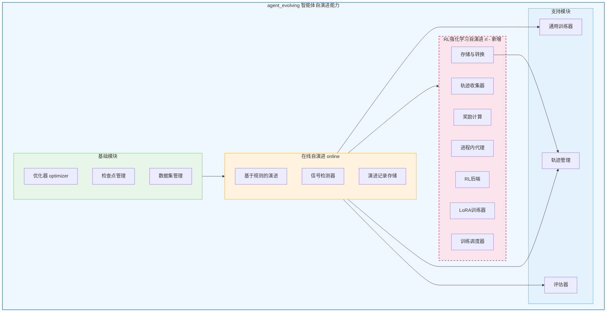
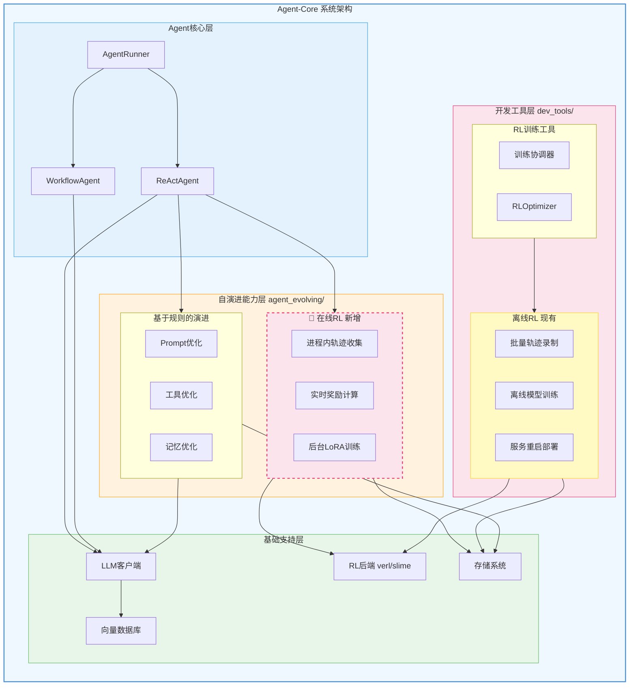
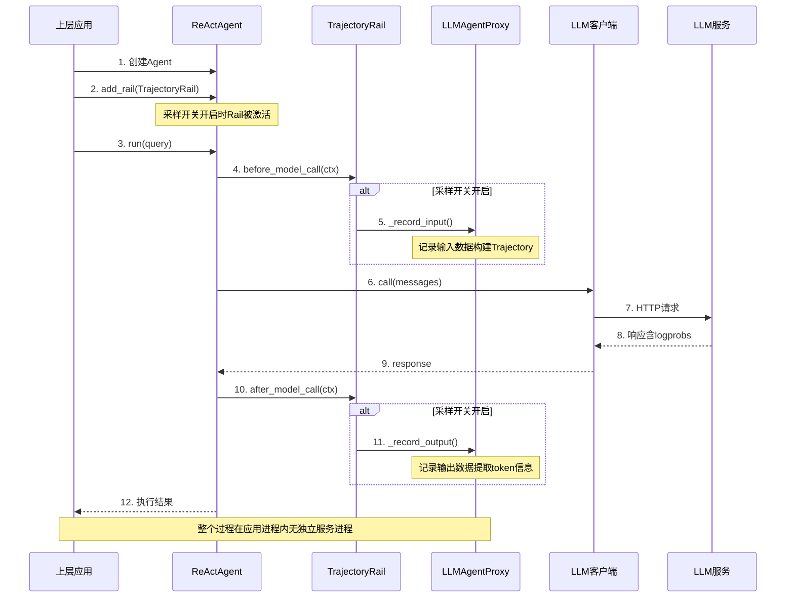
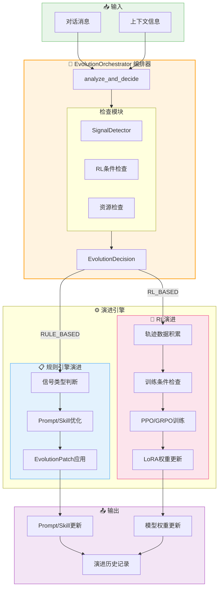
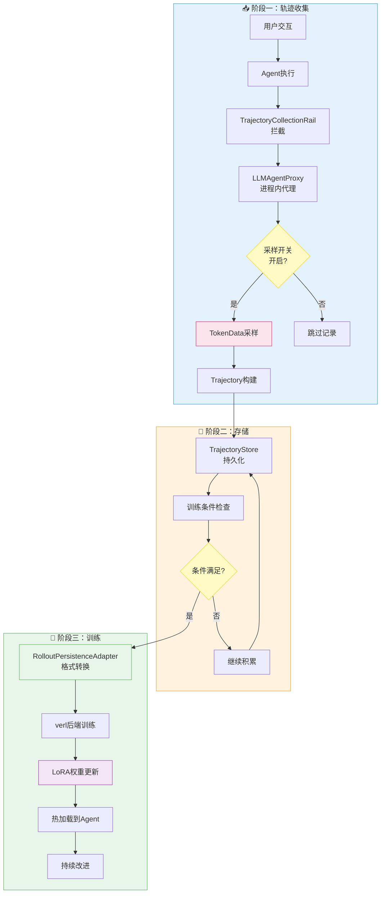
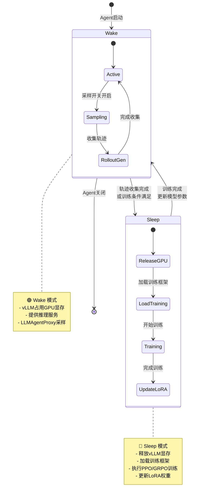
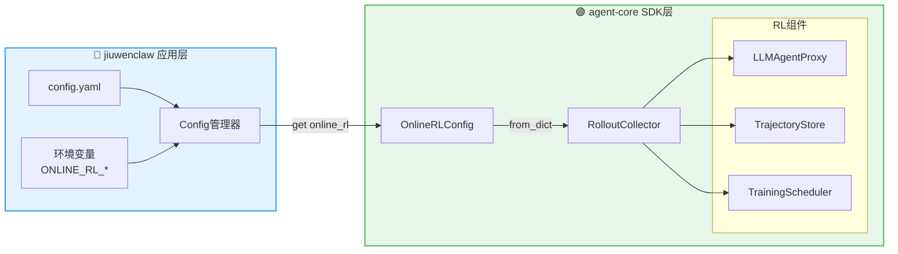
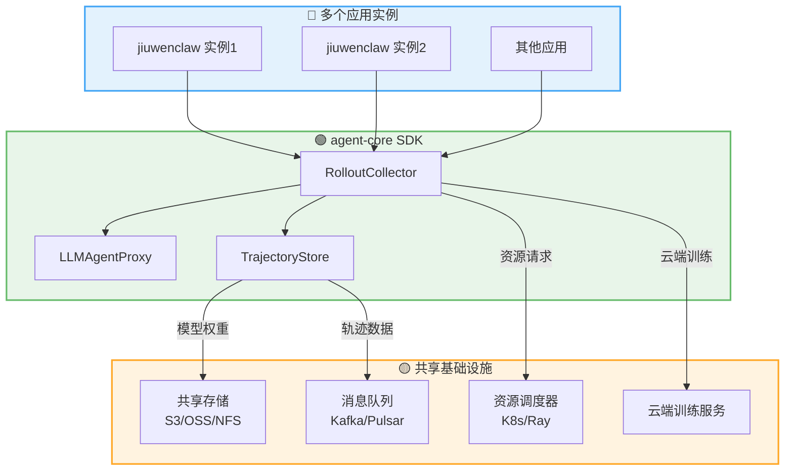
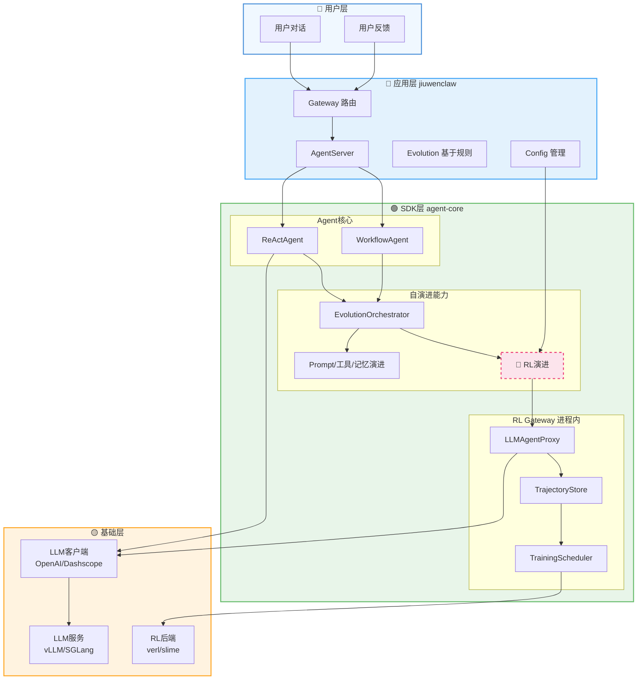

# Jiuwen Agent-Core 在线强化学习框架设计文档 (v4.0 - 纯SDK版)

> **版本**: v4.0 (纯SDK版)
> **日期**: 2026-04-03
> **状态**: 设计完成
> **作者**: Sisyphus (AI Agent)
> **前序版本**: v3.0 (`docs/superpowers/specs/2026-03-31-online-rl-framework-design-v3.md`)
> **参考文档**: `docs/superpowers/reviews/2026-04-01-v3-design-issues.md`

***

## 1. 背景与目标

### 1.1 问题陈述

当前 Jiuwen 平台已有一套 RL 方案：

- **离线RL**: `dev_tools/agentrl/` — 训练前批量录制轨迹 → 停止Agent → 执行训练 → 重启服务 (需要停机，用户体验差)

为参考在线学习方案，我们调研了第三方开源项目：

- **元学习参考**: MetaClaw — 在线学习，无需GPU (依赖云端Tinker/MinT/Weaver，不兼容verl)
- **强化学习框架参考**: openclaw-rl — 基于slime的异步RL框架 (arXiv:2603.10165)

**核心需求**: 在 agent-core 中构建**在线RL能力**，使智能体在不停机的前提下，一边与用户交互，一边收集轨迹，在合适的时机自动触发 LLM RL 训练。

### 1.2 设计目标

1. **零停机**: Agent 服务持续运行，训练在后台异步执行
2. **最小侵入**: 不颠覆 agent-core 和 jiuwenclaw 的既有架构
3. **SDK纯粹性**: 保持agent-core作为Python SDK的定位，避免独立服务
4. **依赖轻量化**: 使用可选依赖管理，避免引入重型框架测；
5. **可扩展**: 算法和调度策略未定，预留充分适配空间
6. **可复用**: 复用业界成熟组件（verl、vLLM 等），避免从零实现
7. **泛化性**: agent-core 的在线RL能力可服务于任何基于它的智能体应用

### 1.3 范围界定

**本次设计包含**:

- RL Gateway (进程内组件: Proxy + SessionRecorder + Reward 外部接口)
- 融合数据格式 (Trajectory + Turn + TokenData + 灵活Reward + 状态机)
- 轨迹存储 (轻量级存储 + verl DataProto 转换层)
- 训练调度器 (TriggerPolicy 抽象 + ResourceScheduler 轻量封装 + BatchUserLoRATrainer)
- RL 后端轻薄抽象 (verl 优先，slime 预留)
- LoRA 权重管理 (统一版本化存储 + 热加载通知 + 元数据)

**本次设计不包含**:

- 具体 RL 算法实现（GRPO/PPO 等由后端插件提供）
- Reward 计算器的具体算法（预留外部插件接口）
- 多模态数据的具体处理（预留扩展字段）
- 具体调度策略实现（预留策略接口）
- 独立HTTP服务（不再作为在线RL的一部分）

### 1.4 核心设计原则

1. **纯SDK模式**: RL功能作为agent-core的进程内组件，通过RAIL钩子机制注入
2. **自演进能力整合**: RL作为智能体自演进能力的一部分，与prompt、工具、记忆自演进并列，整合到`agent_evolving`组件中
3. **依赖分离**: 使用可选依赖`openjiuwen[online-rl]`管理RL相关功能
4. **按需启用**: 提供采样开关，关闭时性能开销可忽略不计
5. **架构一致性**: 与现有组件（Runner、Context Engine、Workflow）的进程内调用模式保持一致
6. **应用层配置**: 配置由上层应用（如jiuwenclaw）管理，agent-core提供默认值和配置类

***

## 2. 架构设计 (v4.0 纯SDK版)

### 2.1 架构概览

#### 2.1.1 agent_evolving 整体架构

> **优化说明**: 原图使用 `\n` 和 `├──` 试图在节点内展示层级关系，但Mermaid不支持这种语法。
> 优化方案：采用扁平化结构，用颜色分组代替深层嵌套，确保兼容性。




#### 2.1.2 Online vs Offline RL 在Agent-Core中的位置

> **优化说明**: 原图使用 `\n` 和 `├──` 在节点内展示子组件，已改用独立子节点。



#### 2.1.3 架构层次说明

```text
┌─────────────────────────────────────────────────────────────────────────────┐
│              agent_evolving/ 智能体自演进能力                                 │
├─────────────────────────────────────────────────────────────────────────────┤
│                                                                             │
│  ┌─────────────────────────────────────────────────────────────────────┐  │
│  │  optimizer/          checkpointing/         dataset/               │  │
│  │  优化器              检查点管理             数据集管理               │  │
│  │  (prompt/工具/记忆)  (状态保存)             (案例加载)               │  │
│  └─────────────────────────────────────────────────────────────────────┘  │
│         │                                                                  │
│         ▼                                                                  │
│  ┌─────────────────────────────────────────────────────────────────────┐  │
│  │  online/ 在线自演进                                                   │  │
│  │                                                                     │  │
│  │  evolver.py         signal_detector.py      store.py               │  │
│  │  基于规则的演进      信号检测器            演进记录存储              │  │
│  │                                                                     │  │
│  │  rl/ 强化学习自演进 (新增)                                            │  │
│  │  ├── collector.py      轨迹收集器                                    │  │
│  │  ├── reward_scorer.py  奖励计算                                      │  │
│  │  ├── models.py         数据模型                                      │  │
│  │  ├── gateway/          进程内代理                                    │  │
│  │  ├── store/            轨迹存储+转换                                 │  │
│  │  ├── backend/          RL后端轻封装                                  │  │
│  │  ├── trainer/          LoRA管理                                      │  │
│  │  └── scheduler/        训练触发调度                                  │  │
│  └─────────────────────────────────────────────────────────────────────┘  │
│         │                                                                  │
│         ▼                                                                  │
│  ┌─────────────────────────────────────────────────────────────────────┐  │
│  │  trainer/            evaluator/            trajectory/             │  │
│  │  训练器              评估器                轨迹管理                  │  │
│  │  (通用训练逻辑)      (性能评估)            (轨迹操作)                │  │
│  └─────────────────────────────────────────────────────────────────────┘  │
│                                                                             │
└─────────────────────────────────────────────────────────────────────────────┘

┌─────────────────────────────────────────────────────────────────────────────┐
│              dev_tools/rl_training/ RL训练工具 (离线特有)                    │
├─────────────────────────────────────────────────────────────────────────────┤
│                                                                             │
│  coordinator/          optimizer/                                           │
│  训练协调器            RLOptimizer用户入口                                   │
│  (rollout生成→分类→批次构建)                                                 │
│                                                                             │
└─────────────────────────────────────────────────────────────────────────────┘
```

### 2.2 目录结构

```
agent-core/openjiuwen/
├── agent_evolving/                    # 智能体自演进能力
│   ├── __init__.py                    # 导出自演进API
│   ├── constant.py                    # 常量定义
│   ├── utils.py                       # 工具函数
│   ├── orchestrator.py                # 演进策略编排器 (EvolutionOrchestrator)
│   │
│   ├── optimizer/                     # 优化器（prompt/工具/记忆）
│   │   ├── llm_call/                  # LLM调用优化
│   │   ├── tool_call/                 # 工具调用优化
│   │   └── memory_call/               # 记忆调用优化
│   │
│   ├── checkpointing/                 # 检查点管理
│   │   ├── manager.py                 # 检查点管理器
│   │   ├── store_file.py              # 文件存储
│   │   └── types.py                   # 类型定义
│   │
│   ├── dataset/                       # 数据集管理
│   │   ├── case.py                    # 案例定义
│   │   └── case_loader.py             # 案例加载器
│   │
│   ├── online/                        # 在线自演进
│   │   ├── evolver.py                 # 基于规则的演进
│   │   ├── signal_detector.py         # 信号检测器
│   │   ├── store.py                   # 演进记录存储
│   │   └── schema.py                  # 演进模式定义
│   │
│   ├── rl/                            # 强化学习自演进 (新增)
│   │   ├── __init__.py                # 导出RL API
│   │   ├── config.py                  # RL配置Schema
│   │   ├── collector.py               # 轨迹收集器 (RolloutCollector)
│   │   ├── trajectory_rail.py         # 轨迹收集RAIL钩子 (TrajectoryCollectionRail)
│   │   ├── reward_scorer.py           # 奖励计算
│   │   ├── models.py                  # 数据模型 (Trajectory、TokenData等)
│   │   ├── gateway/                   # RL Gateway (进程内组件)
│   │   │   ├── proxy.py               # LLM代理 (LLMAgentProxy)
│   │   │   └── recorder.py            # 会话轨迹记录
│   │   ├── store/                     # 在线存储 + DataProto转换
│   │   │   ├── trajectory_store.py
│   │   │   └── rollout_adapter.py     # RolloutPersistenceAdapter
│   │   ├── backend/                   # RL后端轻薄封装
│   │   │   ├── rl_backend.py
│   │   │   ├── verl_backend.py
│   │   │   └── slime_backend.py       # 预留
│   │   ├── trainer/                   # LoRA训练器
│   │   │   ├── lora_trainer.py
│   │   │   └── lora_manager.py
│   │   └── scheduler/                 # 训练触发调度
│   │       ├── trigger.py
│   │       ├── training_scheduler.py
│   │       └── resource_scheduler.py
│   │
│   ├── trainer/                       # 通用训练器
│   │   ├── trainer.py                 # 训练器实现
│   │   └── progress.py                # 训练进度
│   │
│   ├── evaluator/                     # 评估器
│   │   ├── evaluator.py               # 评估器实现
│   │   └── metrics/                   # 评估指标
│   │       ├── base.py
│   │       ├── exact_match.py
│   │       └── llm_as_judge.py
│   │
│   └── trajectory/                    # 轨迹管理
│       ├── types.py                   # 轨迹类型定义
│       └── operation.py               # 轨迹操作
│
│   └── updater/                       # 状态更新器
│       ├── protocol.py                # 更新协议
│       ├── single_dim.py              # 单维更新
│       └── multi_dim.py               # 多维更新
│
└── dev_tools/
    └── rl_training/                   # RL训练工具 (离线特有)
        ├── __init__.py                # 从 agent_evolving.rl 导入公共组件
        ├── coordinator/               # 训练协调器 (离线特有)
        │   ├── training_coordinator.py
        │   ├── batch_builder.py
        │   └── encoding.py
        └── optimizer/                 # RLOptimizer 用户入口 (离线特有)
            └── rl_optimizer.py
```

### 2.3 核心组件设计

#### 2.3.1 RL Gateway (进程内组件)

**架构图**:



```python
# agent-core/openjiuwen/agent_evolving/rl/gateway/proxy.py
class LLMAgentProxy:
    """LLM代理（进程内组件）
    
    职责：
    - 拦截LLM调用
    - Token级数据采样
    - 轨迹构建
    - 元数据记录
    - 将轨迹发送给LLM推理服务端口（openai兼容接口）
    """
    def __init__(self, original_client, config):
        self._original_client = original_client  # 原始大模型客户端
        self._config = config
        
    async def call(self, messages, **kwargs):
        """保持与原始客户端完全相同的接口"""
        # 1. 记录输入数据（如果采样功能开启）
        if self._config.sampling_enabled:
            self._record_input(messages, **kwargs)
            
        # 2. 调用原始客户端
        response = await self._original_client.call(messages, **kwargs)
        
        # 3. 记录输出数据（如果采样功能开启）
        if self._config.sampling_enabled:
            self._record_output(response)
            
        # 4. 返回原始响应（保持接口不变）
        return response
```

#### 2.3.2 RolloutCollector (核心组件)

```python
# agent-core/openjiuwen/agent_evolving/rl/collector.py
class RolloutCollector:
    """在线轨迹收集器"""
    def __init__(self, config):
        self.config = config
        self._gateway = None
        self._storage = None
        
        # 仅当采样功能开启时，初始化组件（懒加载）
        if config.enabled and config.sampling_enabled:
            self._storage = self._init_storage()
            
    @classmethod
    def create(cls, config=None) -> "RolloutCollector":
        """工厂方法 - 创建轨迹收集器"""
        from .config import OnlineRLConfig
        config = config or OnlineRLConfig()
        return cls(config)
    
    def get_trajectory_rail(self):
        """获取轨迹收集RAIL钩子，仅当采样功能开启时返回"""
        if not (self.config.enabled and self.config.sampling_enabled):
            return None
            
        if self._gateway is None:
            from .gateway.proxy import LLMAgentProxy
            self._gateway = LLMAgentProxy(self.config)
            
        return TrajectoryCollectionRail(self._gateway)
    
    async def collect(self, session) -> Trajectory:
        """收集轨迹 - 进程内直接调用"""
        if not (self.config.enabled and self.config.sampling_enabled):
            return None
            
        # 确保组件已初始化
        if self._gateway is None:
            from .gateway.proxy import LLMAgentProxy
            self._gateway = LLMAgentProxy(self.config)
            
        trajectory = await self._gateway.sample(session)
        await self._storage.save(trajectory)
        return trajectory
```

#### 2.3.3 配置类设计

```python
# agent-core/openjiuwen/agent_evolving/rl/config.py
@dataclass
class OnlineRLConfig:
    """在线RL配置类（默认值）"""
    # 核心开关
    enabled: bool = False                    # 总开关
    sampling_enabled: bool = False           # 轨迹采样开关（可按需开启）
    
    # 存储配置
    storage_trajectory_db: str = "~/.jiuwenclaw/online_rl/trajectory.db"
    storage_lora_weights: str = "~/.jiuwenclaw/online_rl/lora_weights"
    storage_cache_size_mb: int = 1024        # 缓存大小限制
    
    # 训练配置
    training_algorithm: str = "grpo"          # grpo | ppo | dpo
    training_learning_rate: float = 1e-5
    training_batch_size: int = 8
    training_accumulation_steps: int = 4
    training_max_episodes: int = 1000         # 每次训练最大episode数
    training_reward_model: str = "prm"        # prm | binary | custom
    
    # 调度器配置
    scheduler_enabled: bool = True            # 是否启用调度
    scheduler_idle_threshold_minutes: int = 30  # 键盘空闲检测
    scheduler_sleep_window_start: str = "23:00"
    scheduler_sleep_window_end: str = "07:00"
    scheduler_calendar_integration: bool = False  # Google Calendar集成
    
    @classmethod
    def from_dict(cls, config_dict: dict) -> "OnlineRLConfig":
        """从应用层配置字典创建"""
        return cls(**{
            k: config_dict.get(k, v)
            for k, v in cls.__dataclass_fields__.items()
        })
```

#### 2.3.4 RolloutPersistenceAdapter

```python
# agent-core/openjiuwen/agent_evolving/rl/store/rollout_adapter.py
from openjiuwen.agent_evolving.trajectory.types import Rollout
from verl import DataProto

class RolloutPersistenceAdapter:
    """在线RL轨迹持久化适配器
    
    职责：将在线Trajectory转换为verl DataProto格式
    
    注意：
    - 仅用于在线RL场景
    - 离线RL直接加载DataProto，无需此转换
    """
    
    def __init__(self, encoder):
        self._encoder = encoder
        
    def convert(self, trajectories) -> DataProto:
        """将Trajectory转换为DataProto
        
        Conversion flow:
            Trajectory (online) → Rollout → RolloutWithReward → DataProto (verl)
        """
        rollouts = []
        for trajectory in trajectories:
            # 1. Trajectory → Rollout
            rollout = self._encoder.encode_trajectory(trajectory)
            
            # 2. 添加奖励（如果需要）
            if hasattr(trajectory, 'rewards'):
                rollout.add_rewards(trajectory.rewards)
            
            rollouts.append(rollout)
        
        # 3. Rollout → DataProto
        return self._encoder.encode_rollouts(rollouts)
```

***

## 3. 集成与使用

### 3.1 与Agent的集成

#### 3.1.1 RAIL钩子集成流程图

> **优化说明**: 简化长链式连接，使用更清晰的流程分组，统一配色。

```mermaid
flowchart LR
    subgraph Application["🔵 上层应用"]
        direction TB
        A1["AgentRunner.__init__"]
        A2["读取online_rl配置"]
        A3["创建RolloutCollector"]
        A4["agent.add_rail"]
    end

    subgraph SDK["🟢 agent-core SDK"]
        direction TB
        B1["OnlineRLConfig.from_dict"]
        B2["RolloutCollector.create"]
        B3["get_trajectory_rail"]
        B4["TrajectoryCollectionRail"]
    end

    subgraph Runtime["🟡 Agent运行时"]
        direction TB
        C1["Runner.execute"]
        C2["Rail.on_before_llm_call"]
        C3["Rail.on_after_llm_call"]
        C4["Rail.on_after_tool_call"]
    end

    subgraph Gateway["🔴 RL Gateway 进程内"]
        direction TB
        D1["LLMAgentProxy"]
        D2["_record_input"]
        D3["_record_output"]
        D4["TrajectoryBuilder"]
    end

    %% 初始化流程
    A1 --> A2 --> B1 --> A3 --> B2 --> B3 --> B4 --> A4
    
    %% 运行时流程
    A4 --> C1
    C1 --> C2 --> D2 --> D1
    C1 --> C3 --> D3 --> D1
    D1 --> D4
    C1 --> C4

    style Application fill:#e3f2fd, stroke:#42a5f5, stroke-width:2px
    style SDK fill:#e8f5e9, stroke:#66bb6a, stroke-width:2px
    style Runtime fill:#fff3e0, stroke:#ffa726, stroke-width:2px
    style Gateway fill:#fce4ec, stroke:#ec407a, stroke-width:2px
```



#### 3.1.2 集成代码示例

通过RAIL钩子机制注入RL功能：

> **注意**：现有`dev_tools/agentrl/agent_runtime/trajectory.py`已实现`TrajectoryCollectionRail`。
> 本设计将其迁移到`agent_evolving/rl/trajectory_rail.py`并增强功能（如Token级数据采样）。
> 迁移时需保持与现有`AgentRail`基类的兼容性。

```python
# agent-core/openjiuwen/agent_evolving/rl/trajectory_rail.py
from openjiuwen.core.single_agent.rail.base import AgentRail, AgentCallbackContext

class TrajectoryCollectionRail(AgentRail):
    """轨迹收集RAIL钩子
    
    继承自AgentRail，复用现有的钩子机制。
    在before_model_call中记录输入，在after_model_call中记录输出。
    """
    
    priority = 100  # 高优先级，确保在其他rail之前执行
    
    def __init__(self, gateway):
        self._gateway = gateway
        
    async def before_model_call(self, ctx: AgentCallbackContext) -> None:
        """LLM调用前钩子 - 记录输入数据"""
        if not self._gateway._config.sampling_enabled:
            return
            
        # 从ctx.inputs获取messages和tools
        inputs = ctx.inputs
        messages = getattr(inputs, 'messages', [])
        tools = getattr(inputs, 'tools', None)
        
        # 记录输入数据
        self._gateway._record_input(messages, tools)
    
    async def after_model_call(self, ctx: AgentCallbackContext) -> None:
        """LLM调用后钩子 - 记录输出数据"""
        if not self._gateway._config.sampling_enabled:
            return
            
        # 从ctx.inputs获取response
        response = getattr(ctx.inputs, 'response', None)
        
        # 记录输出数据
        self._gateway._record_output(response)
```

### 3.2 上层应用使用示例

```python
# jiuwenclaw/agentserver/agent_runner.py
from openjiuwen.agent_evolving.rl import RolloutCollector, OnlineRLConfig
from openjiuwen.application import ReActAgent

class AgentRunner:
    def __init__(self, config: Config):
        # 创建Agent
        self.agent = ReActAgent(config.agent_config)
        
        # 读取jiuwenclaw配置
        rl_config_dict = config.get("react.online_rl", {})
        
        # 传递给agent-core SDK
        self.rl_config = OnlineRLConfig.from_dict(rl_config_dict)
        self.rl_collector = RolloutCollector(self.rl_config)
        
        # 添加RAIL钩子（仅当采样开启时）
        rail = self.rl_collector.get_trajectory_rail()
        if rail:
            self.agent.add_rail(rail)
    
    async def run_agent(self, session):
        # 正常执行Agent逻辑
        result = await self.agent.run(session)
        
        # 调用SDK收集轨迹（进程内直接执行）
        await self.rl_collector.collect(session)
        
        return result
```

### 3.3 配置示例

```yaml
# jiuwenclaw/jiuwenclaw/resources/config.yaml
react:
  # ... 现有配置 ...

  # 在线RL配置（纯SDK模式）
  online_rl:
    enabled: false                    # 总开关
    sampling_enabled: false           # 轨迹采样开关（可按需开启）
    storage:
      trajectory_db: "${ONLINE_RL_DB_PATH:-~/.jiuwenclaw/online_rl/trajectory.db}"
      lora_weights: "${ONLINE_RL_LORA_PATH:-~/.jiuwenclaw/online_rl/lora_weights}"
      cache_size_mb: 1024            # 缓存大小限制
    training:
      algorithm: "grpo"              # grpo | ppo | dpo
      learning_rate: 1e-5
      batch_size: 8
      accumulation_steps: 4
      max_episodes: 1000             # 每次训练最大episode数
      reward_model: "prm"            # prm | binary | custom
    scheduler:
      enabled: true                  # 是否启用调度
      idle_threshold_minutes: 30    # 键盘空闲检测
      sleep_window:
        start: "23:00"
        end: "07:00"
      calendar_integration: false   # Google Calendar集成
```

***

## 4. 依赖管理

### 4.1 可选依赖设计

```toml
# agent-core/pyproject.toml
[project.optional-dependencies]
# 核心RL功能（纯SDK模式，轻量级）
online-rl = [
    "numpy>=1.24.0",          # 数据处理（核心依赖，约10MB）
    "pydantic>=2.0.0",        # 数据模型（已在agent-core中使用）
    "aiofiles>=23.0.0",       # 异步文件操作（轻量级，约100KB）
    "verl>=0.1.0",            # RL训练框架
]
```

### 4.2 安装场景

| 用户场景      | 安装命令                                | 依赖负担    | 依赖大小估计           |
| --------- | ----------------------------------- | ------- | ---------------- |
| 基础Agent使用 | `pip install openjiuwen`            | 无额外RL依赖 | \~15MB（仅核心Agent） |
| RL SDK模式  | `pip install openjiuwen[online-rl]` | 轻量级RL依赖 | \~25MB（核心+RL）    |

***

## 5. 性能优化

### 5.1 按需采样

- 实现采样开关，关闭时性能开销可忽略不计
- 通过条件性执行减少不必要的计算

### 5.2 懒加载

- 仅在需要时初始化RL组件
- 避免启动时的额外开销

### 5.3 快速路径检查

- 钩子内部快速判断采样开关状态
- 减少不必要的函数调用

### 5.4 异步处理

- 使用异步IO进行存储操作
- 避免阻塞Agent的主流程

***

## 6. 与现有系统的兼容性

### 6.1 与agent-core的兼容性

- ✅ 保持与现有Agent接口的完全兼容
- ✅ 不改变Agent与大模型API服务的对接接口
- ✅ 与现有RAIL钩子机制无缝集成
- ✅ 整合到`agent_evolving`自演进能力中

### 6.2 与jiuwenclaw的兼容性

- ✅ 复用jiuwenclaw的配置系统
- ✅ 与现有AgentServer架构无冲突
- ✅ 与evolution模块形成互补（基于规则 vs 基于RL）

***

## 7. 与现有自演进能力的关系

### 7.1 演进方式对比

| 演进方式         | 实现位置                     | 演进机制        | 适用场景       |
| ------------ | ------------------------ | ----------- | ---------- |
| **Prompt演进** | `optimizer/llm_call/`    | 基于规则的提示词优化  | 提升指令理解能力   |
| **工具演进**     | `optimizer/tool_call/`   | 基于示例的工具使用优化 | 提升工具调用准确性  |
| **记忆演进**     | `optimizer/memory_call/` | 基于上下文的记忆优化  | 提升长期记忆能力   |
| **RL演进**     | `rl/`                    | 基于强化学习的权重优化 | 提升整体性能和个性化 |

### 7.2 协同工作机制

```text
用户交互
    ↓
Agent执行
    ↓
┌─────────────────────────────────────────────────────────┐
│  自演进能力判断                                          │
│                                                         │
│  1. 规则引擎检测信号 → 触发Prompt/工具/记忆演进          │
│  2. RL采样开关开启 → 触发RL轨迹收集                     │
│  3. 训练条件满足 → 触发RL训练                           │
└─────────────────────────────────────────────────────────┘
    ↓
模型更新（Prompt优化 / LoRA权重更新）
    ↓
持续改进
```

### 7.3 演进策略协同机制

规则引擎和RL触发机制采用**互补协同**模式：

#### 7.3.1 协同机制架构图

> **优化说明**: 统一配色，使用色盲友好方案，简化布局。



#### 7.3.2 在线RL数据流

> **优化说明**: 简化节点标签，统一配色，使用更清晰的阶段划分。



#### 7.3.3 Wake/Sleep 模式适配

> **优化说明**: 保持stateDiagram-v2语法，优化状态标签和注释格式。



#### 7.3.4 配置管理流程

> **优化说明**: 简化布局，使用更清晰的标签和统一配色。



#### 7.3.5 多应用协作机制

> **优化说明**: 优化箭头标签，统一配色，简化子图结构。



#### 7.3.6 完整系统集成视图

> **优化说明**: 简化嵌套结构，统一配色，优化连接线标签。



#### 7.3.7 独立触发

- **规则引擎**：实时检测信号，立即触发演进
- **RL触发**：积累轨迹数据，条件满足后触发训练

#### 7.3.8 协同编排

引入`EvolutionOrchestrator`统一管理演进策略：

```python
# agent-core/openjiuwen/agent_evolving/orchestrator.py
from enum import Enum
from typing import Optional, List
from dataclasses import dataclass

from openjiuwen.agent_evolving.online.signal_detector import SignalDetector

class EvolutionStrategy(str, Enum):
    """演进策略"""
    RULE_BASED = "rule_based"      # 基于规则的演进（Prompt/Skill）
    RL_BASED = "rl_based"          # 基于强化学习的演进（模型权重）
    HYBRID = "hybrid"              # 混合演进

@dataclass
class EvolutionDecision:
    """演进决策"""
    strategy: EvolutionStrategy
    reason: str
    priority: int  # 1-10, 10最高
    resource_requirements: dict
    estimated_duration: float  # 秒

class EvolutionOrchestrator:
    """演进策略编排器"""

    def __init__(self, config):
        self.config = config
        self.rule_engine = SignalDetector()
        self.rl_collector = None  # RL收集器
        self._evolution_history = []

    def analyze_and_decide(self, messages: List[dict], context: dict) -> EvolutionDecision:
        """分析场景并决定演进策略"""

        # 1. 检测规则引擎信号
        signals = self.rule_engine.detect(messages)

        # 2. 检查RL触发条件
        rl_ready = self._check_rl_conditions()

        # 3. 评估资源状态
        resource_status = self._check_resources()

        # 4. 做出决策
        if signals and not rl_ready:
            # 有信号但RL未准备好 → 规则引擎
            return EvolutionDecision(
                strategy=EvolutionStrategy.RULE_BASED,
                reason="检测到演进信号，RL条件未满足",
                priority=7,
                resource_requirements={"cpu": 1, "memory": "1GB"},
                estimated_duration=5.0
            )
        elif not signals and rl_ready:
            # 无信号但RL已准备好 → RL
            return EvolutionDecision(
                strategy=EvolutionStrategy.RL_BASED,
                reason="RL训练条件已满足",
                priority=5,
                resource_requirements={"gpu": 1, "memory": "16GB"},
                estimated_duration=300.0
            )
        elif signals and rl_ready:
            # 都满足 → 根据优先级选择
            if self._is_critical_signal(signals):
                # 关键信号 → 规则引擎优先
                return EvolutionDecision(
                    strategy=EvolutionStrategy.RULE_BASED,
                    reason="检测到关键演进信号",
                    priority=9,
                    resource_requirements={"cpu": 1, "memory": "1GB"},
                    estimated_duration=5.0
                )
            else:
                # 非关键信号 → RL优先
                return EvolutionDecision(
                    strategy=EvolutionStrategy.RL_BASED,
                    reason="RL训练条件已满足，信号非关键",
                    priority=6,
                    resource_requirements={"gpu": 1, "memory": "16GB"},
                    estimated_duration=300.0
                )
        else:
            # 都不满足 → 不演进
            return EvolutionDecision(
                strategy=EvolutionStrategy.HYBRID,
                reason="无演进需求",
                priority=0,
                resource_requirements={},
                estimated_duration=0.0
            )

    def execute_evolution(self, decision: EvolutionDecision):
        """执行演进"""
        if decision.strategy == EvolutionStrategy.RULE_BASED:
            # 执行规则引擎演进
            pass
        elif decision.strategy == EvolutionStrategy.RL_BASED:
            # 执行RL演进
            pass
        # 记录演进历史
        self._evolution_history.append(decision)


class ResourceCoordinator:
    """资源协调器
    
    职责：管理演进任务的资源分配与释放
    """
    
    def __init__(self):
        self._available_resources = {"cpu": 8, "memory": "32GB", "gpu": 1}
        self._allocated_resources = {}
    
    def can_execute(self, decision: EvolutionDecision) -> bool:
        """检查资源是否足够"""
        required = decision.resource_requirements
        for resource, amount in required.items():
            available = self._available_resources.get(resource, 0)
            allocated = self._allocated_resources.get(resource, 0)
            if available - allocated < amount:
                return False
        return True
    
    def allocate(self, decision: EvolutionDecision):
        """分配资源"""
        for resource, amount in decision.resource_requirements.items():
            self._allocated_resources[resource] = \
                self._allocated_resources.get(resource, 0) + amount
    
    def release(self, decision: EvolutionDecision):
        """释放资源"""
        for resource, amount in decision.resource_requirements.items():
            self._allocated_resources[resource] = \
                self._allocated_resources.get(resource, 0) - amount
```

**优先级策略表**：

| 场景 | 优先级 | 策略选择 | 理由 |
|------|--------|---------|------|
| **关键信号**（如任务失败） | 9 | 规则引擎优先 | 快速响应，轻量级 |
| **有信号但RL未准备好** | 7 | 规则引擎 | RL条件不满足 |
| **非关键信号 + RL条件满足** | 6 | RL优先 | 深度优化机会 |
| **RL条件满足但无信号** | 5 | RL | 定期训练 |
| **资源受限** | - | 规则引擎优先 | 轻量级，低资源消耗 |

**资源协调**：`ResourceCoordinator`类（与`EvolutionOrchestrator`同文件）负责管理演进任务的资源分配与释放，确保多种演进策略不会同时竞争有限资源。

#### 7.3.9 冲突解决机制

1. **规则引擎修改Prompt后**：
   - RL训练数据需要重新评估
   - 可能需要重新收集轨迹

2. **RL更新权重后**：
   - 规则引擎的信号检测阈值可能需要调整
   - 已有的演进经验可能需要重新验证

3. **同时触发**：
   - 根据优先级选择一个执行
   - 另一个加入队列，等待资源释放后执行

***

## 8. 未来扩展

### 8.1 服务模式支持

如果未来确有多应用共享需求，可在**jiuwenclaw层**构建RL服务，或参考MetaClaw的独立服务模式（完全解耦，不依赖agent-core）。

### 8.2 多后端支持

当前设计预留了对slime等其他RL后端的支持接口，可在未来根据需求扩展。

### 8.3 多模态支持

数据模型中预留了扩展字段，可在未来支持多模态数据的处理。

***

## 9. 结论

V4版本设计采用纯SDK模式构建在线RL框架，并将其整合到`agent_evolving`自演进能力中，解决了V3版本中存在的架构问题：

1. **SDK层与服务层混淆**：移除了FastAPI服务，将RL功能作为进程内组件
2. **依赖膨胀**：通过可选依赖管理，避免引入重型框架
3. **与jiuwenclaw职责重叠**：明确了RL Gateway与jiuwenclaw Gateway的不同职责
4. **组件定位不清**：明确了RolloutPersistenceAdapter的定位和位置
5. **配置管理缺失**：建立了清晰的配置管理机制
6. **架构整合**：将RL作为自演进能力的一部分，与prompt、工具、记忆演进并列

该设计保持了agent-core作为Python SDK的定位，确保了架构的一致性和可维护性，同时将RL能力整合到智能体自演进的整体框架中，为后续的开发工作提供了清晰的指导。
